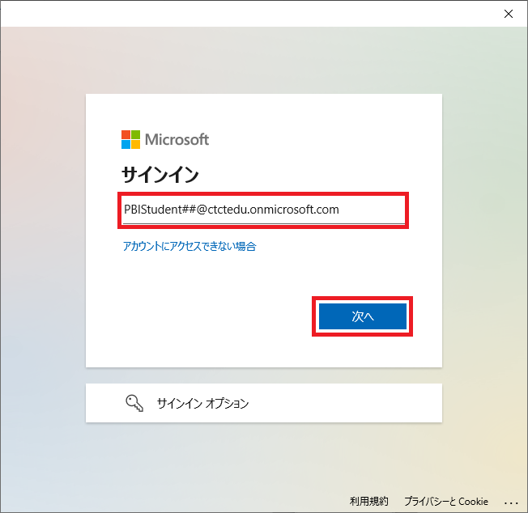
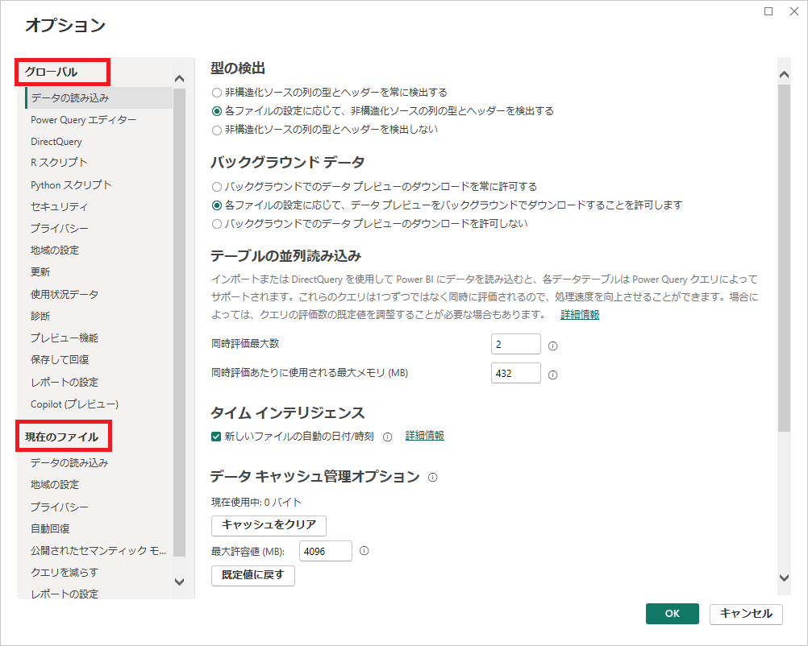

# Power BI Desktopの基本操作

[TOC]

## **ラボ概要**

本ラボでは、Power BI Desktopを使用してデータを取得します。データの取得はBIツールを使用する上でのファーストステップです。

- Power BI Desktopを起動する
- データソースに接続する
- Power Queryエディターを使用してソースデータをプレビューする
- Power Queryエディターでデータプロファイル機能を使用する

**このラボの実施には約40分かかります。**

## **Power BI Desktopの起動**

このタスクではPower BI Desktopを起動して利用を開始します。実際の運用では必須ではありませんが、ほとんどの場合Microsoftアカウントを利用してサインインを実行して利用します。組織によってはシングルサインオン（SSO）によってログイン済みの場合もあります。

また、オプションを確認することでPower BI Desktop全体や、レポート個別に適用される設定を変更することも可能です。

1. 講師より配布されたラボ用仮想マシンの情報を確認し、仮想マシンに接続します。

   接続時に使用する資格情報は以下の通りです。

   | 項目       | 値               |
   | ---------- | ---------------- |
   | ユーザー名 | **ctct**         |
   | パスワード | **Pa55w.rd1234** |

   

2. 仮想マシンに接続したら、デスクトップ上のPower BI DesktopのショートカットをダブルクリックしてPower BI Desktopを起動します。

   

3. Power BI Desktopが起動したらMicrosoftアカウントを使用してサインインします。 **サインインのボタン** はウィンドウ右上、もしくは最初の画面の左下に表示されます。

   

   演習で使用するアカウントは講師より配布されます。アカウント情報の例を以下に示します。

   | 項目       | 値                                                           |
   | ---------- | ------------------------------------------------------------ |
   | メール     | **PBIStudent##@ctctedu.onmicrosoft.com** ※##の部分には01～99の数字になります。 　講師から提示された番号に置き換え、入力してください |
   | パスワード | **Pa55w.rdabc123**                                           |

   

4. メールアドレスの入力等が求められるため、それぞれ入力します。

   

   

   

   

   

5. 画面右上にアカウント情報（メールアドレス等）が表示されていればサインインは完了です。

   

6. 最初に表示される画面の左下にある **オプションと設定** をクリックし、続けて **オプション** をクリックすることで **オプション（設定）** ウィンドウを呼び出すことができます。

   

   

7. オプションウィンドウでは、 **グローバル** のセクションでPower BI Desktop全体に適用される設定を、 **現在のファイル** セクションでは作業中のファイルのみに適用される設定を変更することが可能です。

   

8. 今回はオプションを変更せず、そのまま右下のキャンセルをクリックしてウィンドウを閉じます。

9. 画面が切り替わりますが、元の画面に戻りたい場合は画面上部のリボンメニューから **ファイル** をクリックすることで戻ることが可能です。
   ラボは切り替え後の以下の画面を維持して進めます（戻ってしまった場合は左上に表示されている **左向きの矢印アイコン** をクリック）。

   

   

## **Excelブックからデータを取得する**

このタスクでは、ローカルに保存されたExcelブックをデータソースとして、Power Queryエディターを使用してクエリを作成し、分析用のデータをインポートします。クエリの作成では、Excelファイルから全データを取得するのではなく、分析に必要なデータのみを取捨選択する作業を行います。
このラボでは **Tailspin Toys** と呼ばれる架空企業の販売データを使用します。Tailspin Toysはアメリカで飛行機模型を販売する企業です。

1. **ホーム** リボンタブの **データ** セクションから **[Excelブック] ** をクリックします。

     

1. 表示されたエクスプローラーを使用して、以下のディレクトリに格納されているExcelブックを開きます。

     C:\Users\ctct\Documents\TailspinToys\TailspinToys.xlsx

     

     

1. ファイルを開くと、 **ナビゲーター** ウィンドウが表示されます。画面左側に表示されている5つの項目は、Excelブックに含まれているシートを示しています。それぞれの名称をクリックすると、画面右側にデータのプレビューが表示されます。

    

1. 今回はすべてのシートのデータを使用します。以下5つのチェックボックスすべてにチェックを入れ、最後に画面右下の **データの変換** をクリックします。

    - Category
      販売する商品カテゴリーが含まれます
    - Product
      販売する個々の商品データが含まれます
    - Region
      販売地域のデータが含まれます
    - Sales
      販売実績が含まれます
    - State
      販売する州のデータが含まれます

    

    > 注：**読み込み** をクリックするとすべてのデータが読み取り対象となります。Excelシートやデータベースのテーブルが持つすべてのデータが必要なシチュエーションは少なく、今回のサンプルデータも一部不要なデータを含んでいるため、以降の作業では不要なデータを除外していきます。

1. **データの変換** が完了すると、 **Power Queryエディター** が別ウィンドウで表示されます。場合によってはPower BI Desktopの背面に隠れてしまうことがあるため、表示されない場合はタスクバーから当該ウィンドウを探して表示させてください。

    

    > 注：Power Queryエディターを閉じてしまった、見つけられない場合はホームリボンメニューから **データの変換** をクリックすることで表示させることができます。

    

## **Power Queryエディターでデータをプレビューする**

このタスクでは、Power Queryエディターでデータを確認してプロファイリング実施します。 データの特性や不要なデータの削除（クリーニング）、変換を行う対象の確認作業です。

1. **Power Queryエディター** ウィンドウで、画面左側の **クエリ** ペインを確認します。 **クエリ** ペインには、チェックを付けた各シートに対して1つのクエリが含まれています。このクエリは検索条件のようなもので、データソース（今回はExcelブック）内のどのデータを取得するかを決定するものです。最終的にはテーブルとしてPower BI Desktopに選択されたデータが読み込まれます。

     

1. 各クエリをクリックすると、含まれているデータを確認することができます。ここでは **Product** クエリを確認します。

    Productテーブルには商品情報が含まれています。

1. 左下隅にあるステータスバーに、テーブル統計情報が提供されます。テーブルには8列/20行が含まれています。

     

1. データプレビューペインを水平方向にスクロールすることですべての列項目を確認できます。

1. 列の品質を評価するには、 **表示** リボンタブの **データのプレビュー** グループ内から、 **列の品質** をオンにします。 列の品質機能を使用すると、列にある有効、エラー、または空の値の割合を簡単に判断できます。

     

     

1. 列の分布を評価するには、 **表示** リボン タブの **データのプレビュー** グループ内から、 **列の分布** をオンにします。
    列の分布では値の一意性を確認することができます。 **個別** と **一意** の項目が同値の場合は列内の値に重複がありません。異なる場合については、列の中に重複が見られることを示しています。

    

    

1. 最後に **表示** リボン タブの **データのプレビュー** グループ内から、 **列のプロファイル** をオンにします。

    

1. **列のプロファイル** がオンの状態で特定の列項目をクリックすると、画面下部にプロファイリング結果が表示されます。外れ値などの特定に活用することができます。

    

    

## ラボの完了

このタスクでは、次のラボに向けていくつかの作業を実施して本ラボを完了します。

1. **表示** リボン タブの **データのプレビュー** グループ内から、先ほどオンにした3つのデータ プレビュー オプションをオフにします。

    - 列の品質

    - 列の分布

    - 列のプロファイル

      

1. 作業状況をPower BI Desktopファイルとして保存します。Power BI Desktopウィンドウに切り替え、 **ファイル** をクリック、 **名前を付けて保存** から任意の場所に保存します。画面下部に表示される **このデバイスを参照する** をクリックするとエクスプローラーが表示され、ローカルの場所、ファイル名を指定できます。
    保留中の変更の適用を求めるダイアログが表示されたら、 **[後で適用]** を選択します。

    

    

    > 注：ここで保存したpbixファイルはPower BI で使用する最も一般的な拡張子です。この後作成するデータセットやレポートなど、Power BIに関する様々なデータを含むものです。
