# Power BI Desktopを使用したデータの加工と変換

## **ラボ概要**

本ラボでは、以前のラボで取得したデータを加工・変換し、Power BI Desktopへ読み込みます。データソースから取得したデータのうち、分析に必要なデータのみを取捨選択します。

- Power Queryエディターを使用してデータを加工・変換
- データの読み込みと確認

**このラボの実施には約35分かかります。**

**※前の演習が完了していない場合は、以下のファイルを開いてから手順を開始してください**

> 注：「適用されていない保留中の変更がクエリにあります」のメッセージが表示された場合は、「変更を破棄する」のボタンをクリックして先に進めます。

**C:\Users\ctct\Documents\LabSamples\Lab01.pbix**

## **Power Queryエディターを使用してデータを加工・変換**

このタスクではPower Queryエディターを使用して各クエリを構成します。不要な行列を削除することで、データ量を削減するとともに、データ項目が見やすくなるよう整備していきます。

1. 以前のタスクで使用したウィンドウが開いている場合はそのまま次の作業に進みます。
   Power Queryエディターを閉じてしまった場合はホームリボンメニューから **データの変換** をクリックすることで表示させることができます。Power BI Desktop全体を終了している場合は保存したpbixファイルを開いてからPower Queryエディターを表示させて後続の作業を実施してください。

2. **Power Queryエディター** ウィンドウの **クエリ** ペインから、まずは **Product** クエリを選択します。

   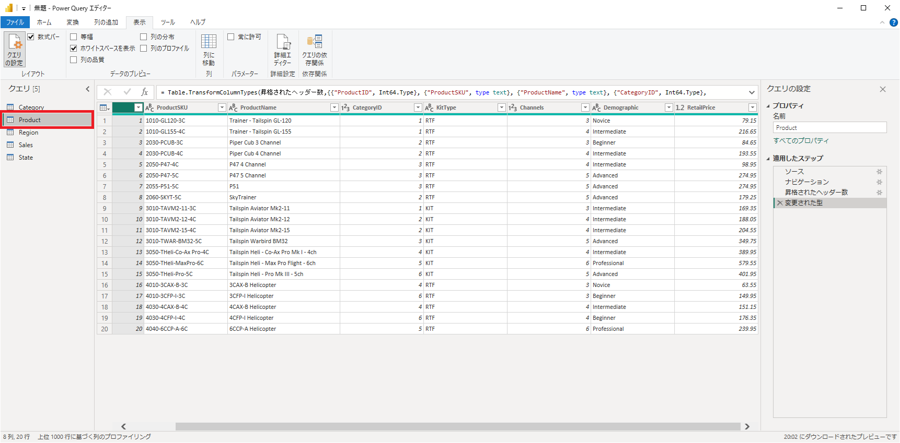

3. 不要な列を削除します。以下の2つの列をCtrlキーを押しながら選択し、 **ホーム** リボンタブから **列の管理** セクションの **列の削除 - 列の削除** をクリックします。

   - ProductSKU
   - RetailPrice

   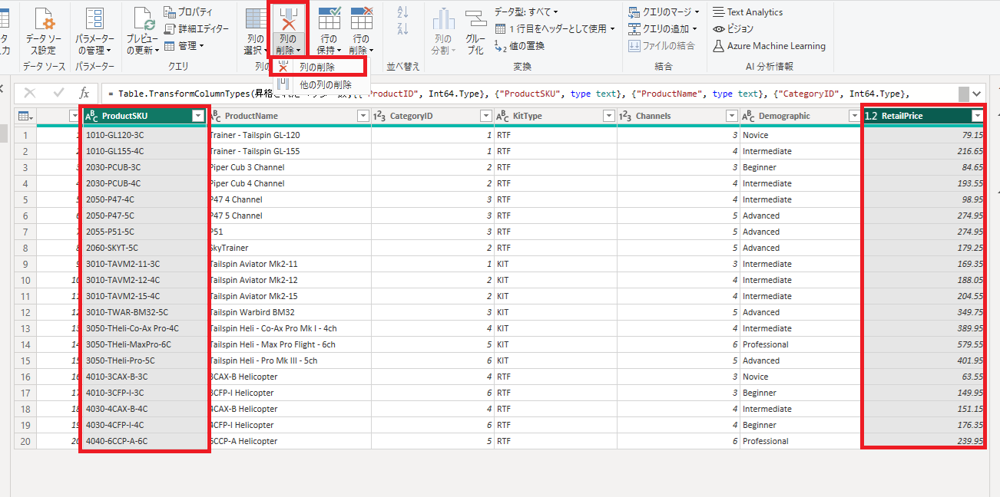

4. 次にクエリ同士を結合します。現状はProductクエリには商品カテゴリを示す **CategoryID** が含まれていますが、直接的なカテゴリ名称は含まれていません。他のクエリに含まれているため、これを結合してひとつのテーブルとして読み込みます。
   カテゴリ名はCategoryクエリに含まれているため、まずは **Category** クエリを確認します。

   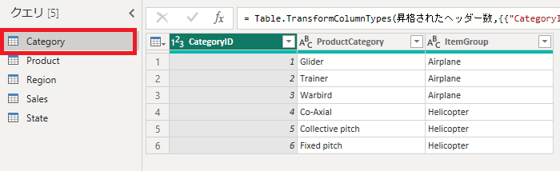

5. **Category** クエリには **CategoryID** 、 **ProductCategory** 、 **ItemGroup** の3列が含まれていることが確認できます。このうち、 **CategoryID** は先ほどの作業で確認した **Product** クエリにも含まれていました。この共通する列を使用して、 **クエリのマージ** を行います。

6. **Product** クエリに対して **Category** クエリをマージするため、再度 **Product** クエリに切り替えます。
   クエリを切り替えた後、 **結合** セクションから **クエリのマージ** をクリックします。

   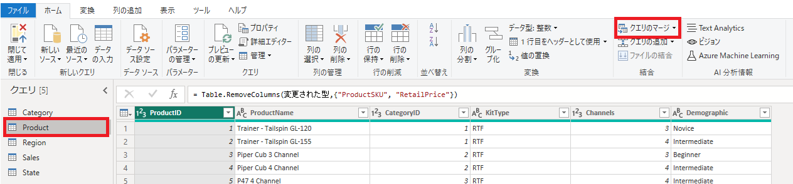

7. **マージ** ウィンドウが表示されます。ウィンドウ中部のドロップダウンリストから **Category** クエリを選択します。

   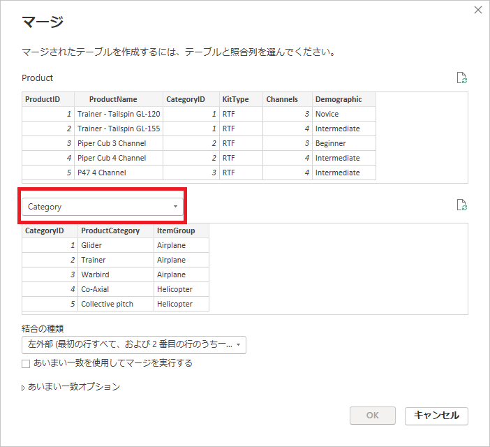

8. **Category** クエリを選択すると列項目が表示されるため、上部のProductクエリ、下部のCategoryクエリともに共通して持つ **CategoryID** を選択します。 
   **結合の種類** では **内部** を選択してから **OK** をクリックします。

   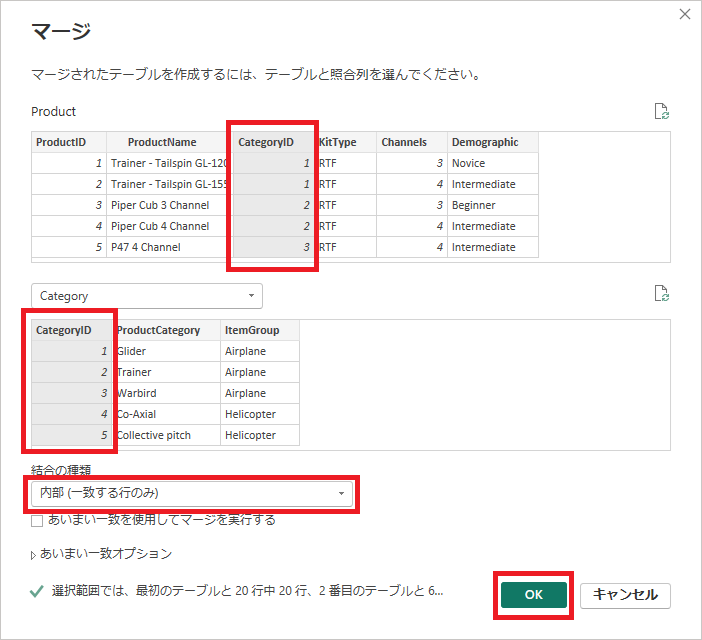

9. Power Queryエディターに戻ると、 **Product** クエリの一番右側に **Category** が列項目として追加されていることが確認できます。

   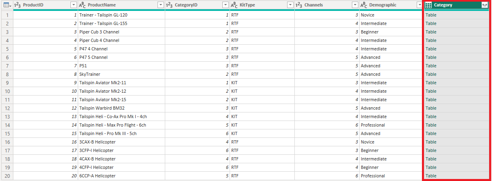

10. **Category** 列はテーブル項目として折りたたまれているため、展開する必要があります。列名の右側にある外に向いた矢印のアイコンをクリックして展開します。以下の2列にチェックを入れ、 **元の列名をプレフィックスとして使用します** のチェックは外します。

   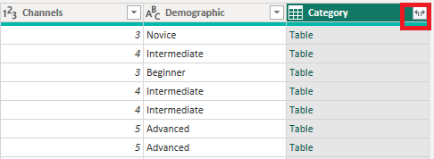

   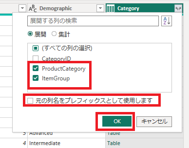

11. これにより **Product** クエリに2列追加され、商品名と商品カテゴリがまとめられました。

12. **Category** クエリはマージしたことで不要となったため、読み込み対象から除外します。 **Category** クエリを右クリックし、 **読み込みを有効にする** をクリックしてチェックを外します。

    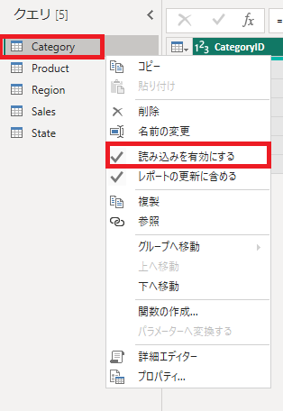

13. 読み込みが無効になると、クエリ名が斜体になります。これにより、Power BI Desktopに読み込まれるテーブル項目には含まれなくなります。

    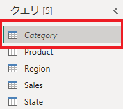

14. 先ほどと同様の手順で **State** クエリに対して **Region** クエリをマージします。 **State** クエリを選択した状態で **クエリのマージ** を開始し、 **Region** クエリと共通する **RegionID** で **内部結合** させます。

    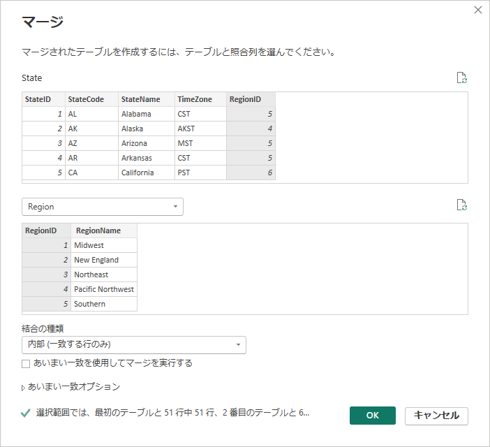

15. テーブル状態でマージされた列を展開します。 **RegionName** のみを選択し、 **元の列名をプレフィックスとして使用します** のチェックは外して展開します。

    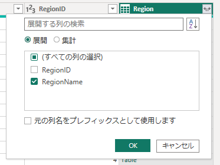

16. **State** クエリで不要な列として、 **TimeZone** 列を削除します。列の削除は列ヘッダーを右クリックして表示されるメニューからも実施可能です。

    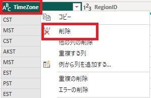

    

    

## データの読み込みと確認

このタスクでは、加工・変換したデータを読み込みます。これにより、Power BI Desktopのメモリ上にデータが展開され、データセットとして保持できるようになります。

1. クエリの編集が完了したら、最後にクエリを適用してデータを読み込みます。 **Power Queryエディター** の **ホーム** リボンメニューにある **閉じて適用** をクリックします。

     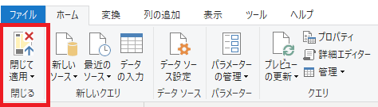

1. 読み込みが完了すると、Power BI Desktopの画面右側 **データペイン** にテーブルが追加されます。以下の4つのテーブルが確認できるはずです。

    - Product

    - Region

    - Sales

    - State

      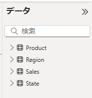

      > 注：Categoryクエリは読み込み対象として無効化しているため、テーブルとして読み込まれません。

1. 画面左側のアイコンをクリックして **テーブルビュー** に切り替えることで、実際に読み込まれたデータを確認することができます。

    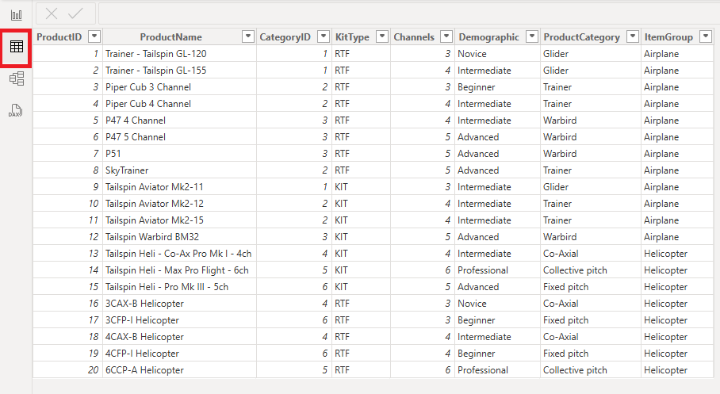

## ラボの完了

このタスクでは、次のラボに向けて一度ラボを保存して本ラボを完了します。

1. 作業状況をPower BI Desktopファイルとして保存します。 **Ctrl+S** 、もしくは **ファイル** をクリックして **保存** 、左上の **フロッピーアイコン** をクリックして上書き保存します。
    保留中の変更の適用を求めるダイアログが表示されたら、 **[後で適用]** を選択します。

※演習が最後まで完了しなかった場合は、以下のファイルを開くことで手順を最後まで実施した状態になります。
C:\Users\ctct\Documents\LabSamples\Lab02.pbix
