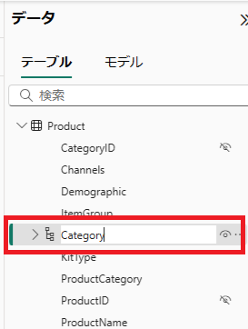

# Power BI Desktopを使用したデータモデリング

## **ラボ概要**

本ラボでは、読み込んだデータの整形を行います。分析がより正しく、より実施しやすいデータとなるよう設定を追加します。

- プロパティの編集
- 階層の設定
- リレーションシップの設定

**このラボの実施には約35分かかります。**

**※前の演習が完了していない場合は、以下のファイルを開いてから手順を開始してください**

> 注：「適用されていない保留中の変更がクエリにあります」のメッセージが表示された場合は、「変更を破棄する」のボタンをクリックして先に進めます。
>
> データの読み込みは完了しているため、再度クエリを適用する必要はありません。

**C:\Users\ctct\Documents\LabSamples\Lab02.pbix**

## **プロパティの編集**

このタスクでは **モデルビュー** を使用して、表や列のプロパティを編集します。

1. 画面左側のアイコンをクリックして **モデルビュー** に切り替えます。

   

2. **Sales** テーブルをクリックして選択します。画面右側の **プロパティペイン** を確認します。

   

3. **プロパティペイン** の **説明** に **「販売実績」** と入力します。

   

   > 注：プロパティの追加や編集は必須ではありませんが、テーブルや列が示す内容や含むデータの特性をわかりやすくするために役立ちます。

4. 次に画面右側の **データペイン** で **Sales** テーブルを展開します。列のプロパティを編集するため、 **UnitPrice** 列を選択します。

   

5. **UnitPrice** は売上金額を示す列となるため、 **プロパティペイン** から **書式** を **通貨** に変更します。

   

6. 続けて **State** テーブルのプロパティを編集します。 **データペイン** で **State** テーブルを展開して、 **StateName** を選択します。

   

7. **StateName** 列はアメリカの州を含むため、 **プロパティペイン** から **データカテゴリ** を **州または都道府県** に変更します。
   **データカテゴリ** の項目はプロパティの詳細を展開することで変更できます。

   

8. 同様に **State** テーブルの **RegionName** 列のプロパティで、 **データカテゴリ** を **国/地域** に変更します。

   > 注：データカテゴリを地理的な情報に設定すると、マップを使用したビジュアルで効果を発揮します

9. 最後にプロパティの一括編集を行います。 **データペイン** でいずれかのテーブル名を右クリックして、 **すべて展開する** をクリックします。

   

10. 展開されたテーブルと列の一覧から、以下の列をCtrlキーを押しながら複数選択します。

   - CategoryID
   - ProductID
   - RegionID ※Regionテーブル
   - CustomerStateID
   - ProductID
   - RegionID ※Stateテーブル
   - StateID

11. 複数選択された状態で、 **プロパティペイン** の非表示ボタンを **オン** （はい）に変更します。

    

12. **データペイン** 上で選択された項目に **目に斜線のアイコン** が付与されているはずです。これにより、当該列はレポートビューでは見えなくなります。

    

    > 注：今回非表示としてID項目のように、データの関連付けに必要だが視覚化する際に表示項目として使用しない列は非表示としておくことにより、データ選択がより容易となります。

## 階層の設定

このタスクでは、列の階層を設定します。階層は列間での上下関係を構成するものとなり、データのドリルダウン（掘り下げ）を行う際に使用できます。

1. **モデルビュー** を使用して階層を設定します。 **Product** テーブルの以下の列で階層構造を形成します。

     - ItemGroup
     - ProductCategory
     - ProductName

     

1. 階層を構成したい列を右クリックして **階層の作成** を選択します。今回は **ItemGroup** 列を右クリックして開始します。

    

1. **ItemGroup階層** という名前の階層が作成されます。階層の名前を変更するには、階層名をダブルクリックしてテキストボックスに新しい名前を入力します。今回は **Category** に名称を変更します。

    

1. **Category** 階層に新しい列を追加します。階層をクリックし、 **プロパティペイン** の **階層** セクションにて **ProductCategory** および **ProductName** をドロップダウンリストで選択し、追加します。

    

1. 階層が以下の画像の順になっていることを確認し、 **レベルの変更を適用します** をクリックして階層構造を更新します。

    

    > 注：順序が異なる場合は、ドラッグアンドドロップで入れ替えを行うことができます。また、レベルの変更を適用しなかった場合は、列の追加や順序の変更といった作業内容が失われます。

1. この作業により、商品カテゴリを掘り下げ可能な階層が作成されました。 **データペイン** にも階層ツリーが表示されます。

    

1. 同様に **State** テーブル内でも階層を構成します。以下の列を含む階層を作成してください。階層の名前は **Regions** とします。

    - RegionName
    - StateName

    

## リレーションシップの設定

このタスクでは、リレーションシップの確認と設定を行い、テーブル間でのデータ連携が正しく行われるようにします。階層の確認も含めて、マトリックスビジュアルを使用して進めます。

1. まずは現状のデータを確認します。画面左側のアイコンを使用して、 **レポートビュー** に切り替えます。

   

1. **レポートビュー** の **視覚化ペイン** で **マトリックス** ビジュアルを選択します。

   

   > 注：マトリックスビジュアルは表形式のアイコンに青い塗りつぶしがあるものです。塗りつぶしがないものはテーブルビジュアルになります。各ビジュアルのアイコンにマウスオーバーすることで、ツールチップでビジュアル名称が表示されます。

1. マトリックスビジュアルがレポートページに作成されます。ページの空白部分をクリックしてビジュアルの選択を解除し、もう一つ **マトリックス** ビジュアルを作成します。

1. 作成されたふたつめのビジュアルを移動させます。ビジュアルはドラッグすることで場所を移動することが可能です。

   

1. それぞれのマトリックスビジュアルに項目を追加します。ひとつめのマトリックスビジュアル（左側）に **Product** テーブルの **Category** 階層を追加します。 列をドラックしてビジュアル上でドロップすることで追加可能です。

   

1. 同様に **Sales** テーブルの **UnitPrice** を追加します。マトリックスビジュアルに **ItemGroup** とそれぞれの **UnitPrice** が集計された値が表示されます。

   

   > 注：ここに表示されているUnit Priceの合計は実際の販売実績額とは異なります。今回のラボではカテゴリごとに集計が行われていることを確認するために使用しています。

1. マトリックスビジュアルを選択するとビジュアル端に表示される **下向きの矢印が分岐しているアイコン** をクリックすると、階層を展開してドリルダウンを行うことが可能です。

   

1. ふたつめのマトリックスビジュアルに移ります。ひとつめのビジュアルと同じ手順で、**State** テーブルの **Regions** 階層と **Sales** テーブルの **UnitPrice** を追加します。

1. 表示された内容を確認します。**Category** 階層の時とは異なり、すべての **RegionName** 行で同じ値が集計されていることがわかります。
   これは **State** テーブルと **Sales** テーブルの間にリレーションシップが構成されていないことに起因します。

   

1. この問題を解消するため、 **モデルビュー** を使用してリレーションシップを構成します。モデルビューに切り替えます。

1. **モデルビュー** では4つのテーブルのリレーションシップが確認できます。**Sales** テーブルと **Product** テーブル間にはリレーションシップが構成されています。テーブル同士をつなぐ線にマウスオーバーするとリレーションシップが構成されている列がハイライトされます。

   

1. これらのテーブルでは **ProductID** 列をベースとしてリレーションシップが構成されています。これはデータ読み込み時に自動で設定されたものです。
   同じ列名、データ型を持つテーブル間では自動的にリレーションシップが構成されます。

1. 一方で **Sales** テーブルと **State** テーブル間ではリレーションシップが **構成されていない** ことも確認できるはずです。
   先ほどのマトリックスビジュアルで値が集計されなかった原因はここにあります。

   

1. 2つのテーブル間でリレーションを構成します。列名は異なりますが、 **Sales** テーブルの **CustomerStateID** と **State** テーブルの **StateID** は同じ特性を持つデータを保持しています。リレーションシップを構成したい列から列に対してドラッグアンドドロップで関連付けを行います。

   

1. **新しいリレーションシップ** のウィンドウが表示されます。 **State** テーブルの **StateID** から **Sales** テーブルの **CustomerStateID** へ **一対多** のカーディナリティが設定されていることを確認し、 **保存** をクリックします。

   

1. これにより **Sales** テーブルと **State** テーブル間ではリレーションシップが構成されました。

   

1. 再びビューを切り替えて、 **レポートビュー** へ移動します。

1. **Regions** 階層と **UnitPrice** を追加したマトリックスビジュアルの値が変化していることが確認できます。リレーションシップの構成により、2つのテーブル間でのデータ連携が行われ、集計が実行されています。

   

1. 先ほどと同様に **Regions** 階層もドリルダウンすることで、各州の集計結果を確認することが可能です。

   

## ラボの完了

このタスクでは、次のラボに向けて一度ラボを保存して本ラボを完了します。

作業状況をPower BI Desktopファイルとして保存します。 **Ctrl+S** 、もしくは **ファイル** をクリックして **保存** 、左上の **フロッピーアイコン** をクリックして上書き保存します。
保留中の変更の適用を求めるダイアログが表示されたら、 **[後で適用]** を選択します。

※演習が最後まで完了しなかった場合は、以下のファイルを開くことで手順を最後まで実施した状態になります。
C:\Users\ctct\Documents\LabSamples\Lab03.pbix

