# Power BI Desktopを使用したデータの追加

## **ラボ概要**

本ラボでは、データソースから取得したデータには存在しないデータを新たに作成します。分析に必要なデータが不足している場合は、計算列やDAXを使用してテーブルや列を作成することで解決できる場合があります。

- 計算列の作成
- DAXを使用したテーブル作成

**このラボの実施には約45分かかります。**

## 計算列の作成

このタスクでは計算列を作成して、既存のデータに存在しない分析用の項目を追加します。計算列ではテーブルに対して列が追加され、各行に値が保持されます。

1. 以前のタスクで使用したウィンドウが開いている場合はそのまま次の作業に進みます。
   Power BI Desktopを終了している場合は保存したpbixファイルを開いてから後続の作業を実施してください。

2. 画面左側のビューを切り替えて、 **テーブルビュー** に移動します。

   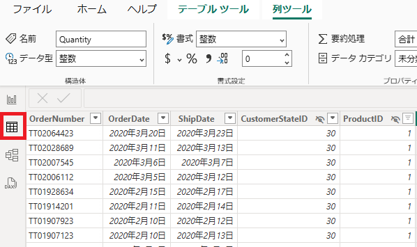

3. **Sales** テーブルに新しい計算列を追加します。 **Sales** テーブルではそれぞれの注文に対する合計金額を示す列が存在していません。
   注文された商品の数を示す **Quantity** と 個々の商品価格を示す **UnitPrice** を掛け合わせて合計金額を算出して列として追加します。

4. **Sales** テーブルを選択した状態で、画面上部の **テーブルツール** リボンメニューの **計算** セクションから **新しい列** をクリックします。

   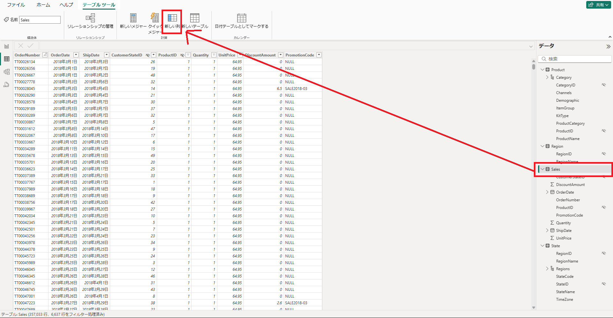

5. **列ツール** に切り替わり、 **数式バー** が有効になります。 **数式バー** に以下の計算式を入力します。

   ```
   TotalPrice = 'Sales'[UnitPrice] * 'Sales'[Quantity]
   ```

   

6. 入力が完了したら、Enterキーを押して確定します。確定すると新しい **TotalPrice** 列が **Sales** テーブルに追加されます。

   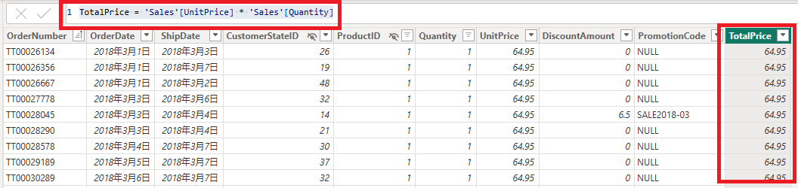

7. これで正しい販売実績額を分析で使用することができるようになりました。先ほどのラボで使用した **マトリックスビジュアル** を編集します。

8. ビューを **レポートビュー** に切り替えて、どちらかのマトリックスビジュアルを選択します。ビジュアルが選択された状態で画面右側の **データペイン** を確認すると、ビジュアルで使用されている列項目にチェックがついていることが確認できます。

   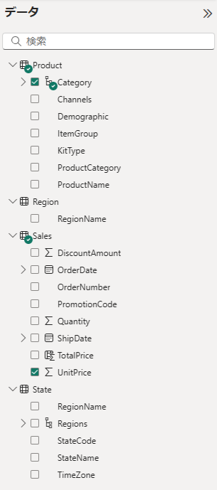

9. 価格を示す項目を **UnitPrice** から **TotalPrice** に変更します。 **UnitPrice** のチェックを外し、新たに **TotalPrice** にチェックを入れます。

   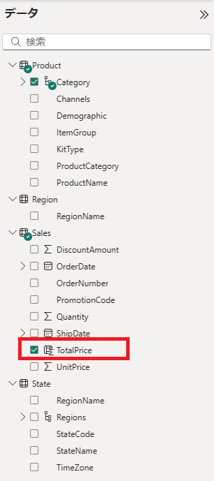

    

10. マトリックスビジュアルを確認すると、価格の合計が増えていることが確認できます。単一の注文で複数個商品が販売された実績が反映されているためです。   

11. 次は **Product** テーブルに列を追加します。 **Product** テーブルには商品情報が含まれていますが、名称やカテゴリーだけで商品画像は含まれていません。今回はここにWeb上から画像を取得できるように構成していきますう。

12. ビューを再度 **テーブルビュー** に切り替えます。

13. 先ほどと同様の手順で列を追加します。 **Product** テーブルを選択した状態で、画面上部の **テーブルツール** リボンメニューの **計算** セクションから **新しい列** をクリックします。

14. **数式バー** に以下の計算式を入力します。

    ```
    image = "https://pbifb.blob.core.windows.net/tailspintoys/" & 'Product'[ProductID] & ".jpg"
    ```

    > 注：ここではAzure（クラウド）にあるストレージの画像データを指定しています

15. 入力が完了したらEnterキーを入力することで **image** 列が作成されます。

    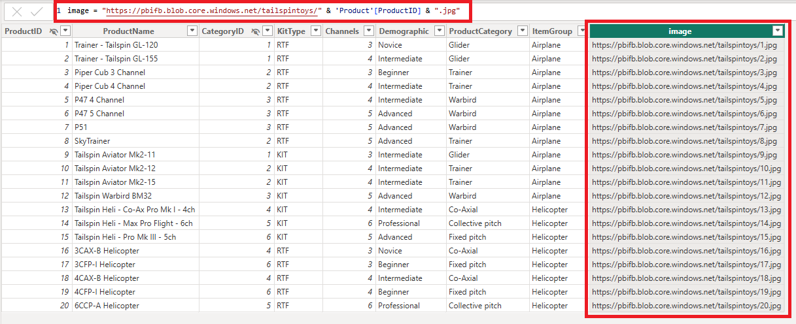

16. このままではURLが文字列として認識されるため、画像のURLをして認識されるよう設定を変更します。

    **image** 列が選択された状態で **列ツール** リボンメニューから **データカテゴリー** の種類を **画像のURL** に変更します。

    

17. これで各商品に対応する画像をビジュアルに追加することができるようになりました。 **レポートビュー** に切り替えて確認します。

18. **レポートビュー** の **Category** 階層を追加しているマトリックスビジュアルを選択します。 **Product** テーブルの先ほど作成した **image** 列を **データペイン** からドラッグアンドドロップで **視覚化ペイン** の **行** セクションに追加します。

    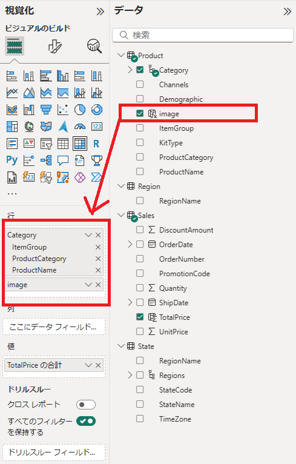

19. マトリックスビジュアルを確認すると、ドリルダウン項目が追加されているはずです。先ほどと同様にすべて展開するか、各商品名左側の **+ボタン** をクリックすると商品画像が表示されます。

    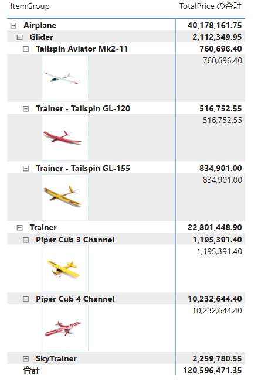

## DAXを使用したテーブル作成

このタスクでは、DAXを使用して新しいテーブルを作成します。データ分析においては時間軸を持つデータが非常に重要ですが、多くのデータソースでは連続したカレンダーのような日付データを持ちません。DAXを活用することで簡単に連続した日付を持つテーブルを作成することができます。

1. **テーブルビュー**に切り替えます。 **ホーム** リボンメニューの **計算** セクションで **新しいテーブル** を選択します。

1. 数式バーに次のように入力します。

     ```
     Date =  
     CALENDARAUTO(3)
     ```

     > 注：CALENDARAUTO() 関数を使用すると、日付値で構成される単一列のテーブルが返されます。自動的にデータ モデルの日付列がスキャンされ、データ モデルに格納されている最も古い日付値と最も新しい日付値が決定されます。次に、この範囲内の各日付に対して 1 つの行が作成されます。範囲をいずれかの方向に拡張して、すべての年のデータが格納されます。
     > この関数は、1 年の最後の月を引数として渡すことができます。省略した場合は12 が設定され、12 月が年度の最終月として認識されます。本ラボでは "3" が入力されているため、3月が年度の最終月として設定されています。

1. 日付値を示す **Date** 列を確認します。

1. 左下のステータス バーからテーブルの統計情報を確認すると、1461行のデータが生成されています。これは4年間分の日付データを表しています。

1. **Date** 列の書式を他のテーブルとあわせるため、 **列ツール** を使用して書式を変更します。 **書式** のドロップダウンリストから、以下の書式を選択します。

     ```
     2001年3月14日 (yyyy"年"m"月"d"日")
     ```

     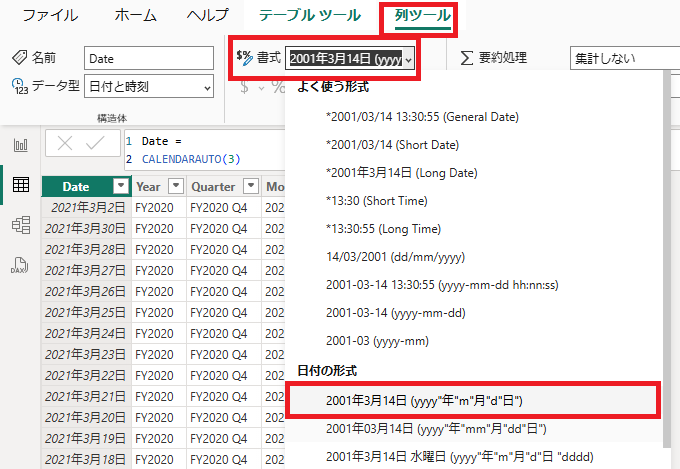

1. 新しく作成された **Date** テーブルに対して列を追加していきます。連続した日付に対して年度、四半期などといった範囲を列として追加します。

1. 年度を列として追加します。数式バーに次のように入力 (またはスニペット ファイルからコピー) して、**Enter** キーを押します。

     ```
     Year =
     "FY" & YEAR('Date'[Date]) - IF(MONTH('Date'[Date]) < 4, 1)
     ```

     > 注：この計算式では文字列合成とDAXによるデータ取得、判定を組み合わせて実行しています。各行の月の値が4以下（1月～3月）の場合は年の値から1を引く条件と計算が行われています。（例：2020/3/1 → FY2019）

1. **Year** 列が追加されていることを確認します。

1. 続けて以下の2つの列も同様に追加します。

     - Quarter

       ```
       Quarter =
       'Date'[Year] & " Q"
           & IF(
               MONTH('Date'[Date]) <= 3,
               4,
               IF(
                   MONTH('Date'[Date]) <= 6,
                   1,
                   IF(
                       MONTH('Date'[Date]) <= 9,
                       2,
                       3
                   )
               )
           )
       
       ```

       > 注：構文は複雑に見えますが、条件文を使用して1-3月は第4期、4-6月は第1期、7-9月は第2期、それ以外（10-12月）は第3期として数字を付与しているものとなります

     - Month

       ```
       Month = 
       FORMAT('Date'[Date], "yyyy年 m月")
       ```

1. 直前の手順で追加した **Month** 列は、**2020年 10月** のような記載となるため、並び替えを行うと1月よりも先に10-12月の行が表示されます（文字列としてみたときに数字が漢字よりも表示順が先とみなされるため）。

     > 注：レポートビューでマトリックスビジュアルを作成して、Month列を追加することで事象を確認できます

1. 上記の問題を解決するために並び替えのキーとして使用する **MonthKey** 列を作成します。

1. **テーブルビュー** にて **Date** テーブルに以下の内容で列を追加します。

      ```
      MonthKey =
      (YEAR('Date'[Date]) * 100) + MONTH('Date'[Date])
      ```

1. これにより、 **2020年 10月** のような行に対して **202010** のような6桁のシンプルな数字で記載された列が追加されました。当該列を基準とすることで正しい月の並び替えが行えます。

1. **Month** 列の並び替えに **MonthKey** 列を基準として使用する設定を行います。データペインで **Month** 列を選択して、 **列ツール** リボンメニューから **列で並び替え** をクリックして、 **MonthKey** を選択します。

1. このタスクで作成した **Date** テーブルには日付を示すものとして以下の3つが作成されているはずです。以前のラボで実施した手順を参考に、新たに **Fiscal** という名前で階層を作成しましょう。

      - Year
      - Quarter
      - Month

1. 最後に **Date** テーブルを **日付テーブル** としてマークします。
      これはこの後の内容で登場する **タイムインテリジェンス** に関するDAX関数で使用します。

1. **テーブルビュー** もしくは **レポートビュー** にて **Date** テーブルを選択し、 **テーブルツール** リボンメニューから **日付テーブルとしてマークする** をクリックします。

      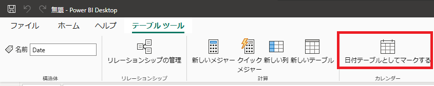

1. **日付テーブルとしてマーク** のウィンドウで **日付テーブルとしてマーク** をオンに、 **日付列を選択する** でドロップダウンリストより **Date** 列を選択して **保存** します。

      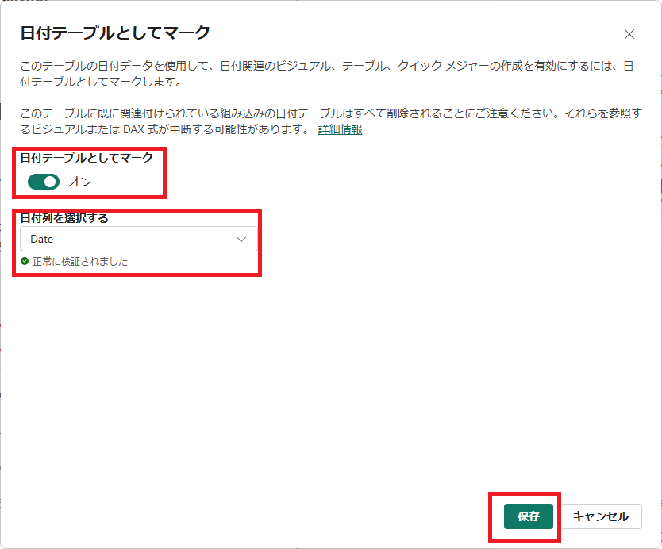

1. **データペイン** を確認し、**Date** テーブルの **Date** 列にカレンダーアイコンが付与されていれば、日付テーブルとしてマークされています。

      

1. 最後に、作成した **Date** テーブルと既存の **Sales** テーブルの間でリレーションシップを作成します。現状、 **Date** テーブルはどのテーブルともリレーションシップが構成されていません。

1. **モデルビュー** に切り替えて、以前のラボと同様に以下のテーブル間で **一対多** のリレーションシップを構成します。

      - Dateテーブル | Date列
      - Salesテーブル | OraderDate列

      > 注：列名が異なる列間でもリレーションシップを構成することが可能です。ただし、データ型やデータ特性が異なる場合はビジュアルに反映した場合に正しい集計結果が導出されない可能性があります。

1. これにより、時間軸を使用した売り上げ分析を行うことができるようになります。


## ラボの完了

このタスクでは、次のラボに向けて一度ラボを保存して本ラボを完了します。

1. 作業状況をPower BI Desktopファイルとして保存します。 **Ctrl+S** 、もしくは **ファイル** をクリックして **保存** 、左上の **フロッピーアイコン** をクリックして上書き保存します。
    保留中の変更の適用を求めるダイアログが表示されたら、 **[後で適用]** を選択します。

    
