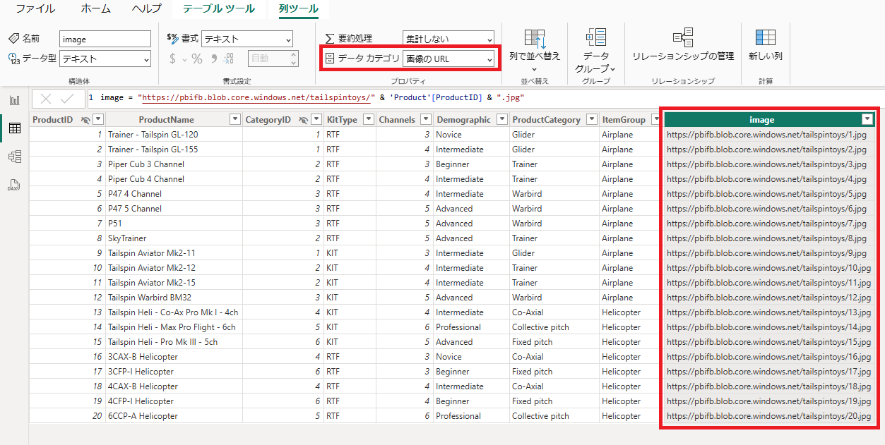

# Power BI Desktopを使用したデータの追加

## **ラボ概要**

本ラボでは、データソースから取得したデータには存在しないデータを新たに作成します。分析に必要なデータが不足している場合は、計算列やDAXを使用してテーブルや列を作成することで解決できる場合があります。

- 計算列の作成
- DAXを使用したテーブル作成

**このラボの実施には約50分かかります。**

## 計算列の作成

このタスクでは計算列を作成して、既存のデータに存在しない分析用の項目を追加します。計算列ではテーブルに対して列が追加され、各行に値が保持されます。

1. 以前のタスクで使用したウィンドウが開いている場合はそのまま次の作業に進みます。
   Power BI Desktopを終了している場合は保存したpbixファイルを開いてから後続の作業を実施してください。

2. 画面左側のビューを切り替えて、 **テーブルビュー** に移動します。

   

3. **Sales** テーブルに新しい計算列を追加します。 **Sales** テーブルではそれぞれの注文に対する合計金額を示す列が存在していません。
   注文された商品の数を示す **Quantity** と 個々の商品価格を示す **UnitPrice** を掛け合わせて合計金額を算出して列として追加します。

4. **Sales** テーブルを選択した状態で、画面上部の **テーブルツール** リボンメニューの **計算** セクションから **新しい列** をクリックします。

   

5. **列ツール** に切り替わり、 **数式バー** が有効になります。 **数式バー** に以下の計算式を入力します。

   ```
   TotalPrice = 'Sales'[UnitPrice] * 'Sales'[Quantity]
   ```

   

6. 入力が完了したら、Entarキーを押して確定します。確定すると新しい **TotalPrice** 列が **Sales** テーブルに追加されます。

   

7. これで正しい販売実績額を分析で使用することができるようになりました。先ほどのラボで使用した **マトリックスビジュアル** を編集します。

8. ビューを **レポートビュー** に切り替えて、どちらかのマトリックスビジュアルを選択します。ビジュアルが選択された状態で画面右側の **データペイン** を確認すると、ビジュアルで使用されている列項目にチェックがついていることが確認できます。

   

9. 価格を示す項目を **UnitPrice** から **TotalPrice** に変更します。 **UnitPrice** のチェックを外し、新たに **TotalPrice** にチェックを入れます。

   

    

10. マトリックスビジュアルを確認すると、価格の合計が増えていることが確認できます。単一の注文で複数個商品が販売された実績が反映されているためです。   

11. 次は **Product** テーブルに列を追加します。 **Product** テーブルには商品情報が含まれていますが、名称やカテゴリーだけで商品画像は含まれていません。今回はここにWeb上から画像を取得できるように構成していきますう。

12. ビューを再度 **テーブルビュー** に切り替えます。

13. 先ほどと同様の手順で列を追加します。 **Product** テーブルを選択した状態で、画面上部の **テーブルツール** リボンメニューの **計算** セクションから **新しい列** をクリックします。

14. **数式バー** に以下の計算式を入力します。

    ```
    image = "https://pbifb.blob.core.windows.net/tailspintoys/" & 'Product'[ProductID] & ".jpg"
    ```

    > 注：ここではAzure（クラウド）にあるストレージの画像データを指定しています

15. 入力が完了したらEnterキーを入力することで **image** 列が作成されます。

    

16. このままではURLが文字列として認識されるため、画像のURLをして認識されるよう設定を変更します。

    **image** 列が選択された状態で **列ツール** リボンメニューから **データカテゴリー** の種類を **画像のURL** に変更します。

    

17. これで各商品に対応する画像をビジュアルに追加することができるようになりました。 **レポートビュー** に切り替えて確認します。

18. **レポートビュー** の **Category** 階層を追加しているマトリックスビジュアルを選択します。 **Product** テーブルの先ほど作成した **image** 列を **データペイン** からドラッグアンドドロップで **視覚化ペイン** の **行** セクションに追加します。

    

19. マトリックスビジュアルを確認すると、ドリルダウン項目が追加されているはずです。先ほどと同様にすべて展開するか、各商品名左側の **+ボタン** をクリックすると商品画像が表示されます。

    

## DAXを使用したテーブル作成

このタスクでは、DAXを使用して新しいテーブルを作成します。データ分析においては時間軸を持つデータが非常に重要ですが、多くのデータソースでは連続したカレンダーのような日付データを持ちません。DAXを活用することで簡単に連続した日付を持つテーブルを作成することができます。

1. **テーブルビュー**に切り替えます。 **[ホーム]** リボン タブの **[計算]** グループの中から、**[新しいテーブル]** を選択します。

1. 


## ラボの完了

このタスクでは、次のラボに向けて一度ラボを保存して本ラボを完了します。

1. 作業状況をPower BI Desktopファイルとして保存します。 **Ctrl+S** 、もしくは **ファイル** をクリックして **保存** 、左上の **フロッピーアイコン** をクリックして上書き保存します。
    保留中の変更の適用を求めるダイアログが表示されたら、 **[後で適用]** を選択します。

    
