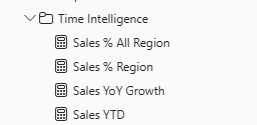

# Power BI Desktopを使用したDAX計算の作成

## **ラボ概要**

本ラボでは、DAXを使用して様々な計算列やメジャーを作成します。以前のラボでもシンプルなDAXをいくつか使用しましたが、より高度な計算を含む内容を本ラボでは実施します。

- DAXを使用したメジャーの作成
- 高度なDAXを使用したメジャーの作成

**このラボの実施には約40分かかります。**

## DAXを使用したメジャーの作成

このタスクではDAXを使用してメジャーを作成します。メジャーは列の値を集計し、ビジュアルの項目やフィルター内容に合わせて動的に変化する値を表示します。

1. 集計された値を確認しながらラボを進めるため、まずは **レポートビュー** で新規にページを作成して、 **マトリックス** ビジュアルを作成します。
   新しいレポートページは、画面下部の **+ボタン** で作成可能です。

   

2. マトリックスビジュアルには **Date** テーブルの **Fiscal** 階層と、 **Sales** テーブルの **TotalPrice** を追加します。

   

3. メジャーを作成し、売り上げの合計値以外の集計値をマトリックスに追加していきます。

4. 売り上げ平均を導出するメジャーを作成します。 **データペイン** で **Sales** テーブルを右クリックして、 **新しいメジャー** を選択します。

   

5. 数式バーに以下のメジャー定義を入力します。

   ```
   Avg Price =  
   AVERAGE(Sales[TotalPrice])
   ```

6. 作成した **Avg Price** メジャーをマトリックスビジュアルに追加します。
   注文一回あたりの平均価格が算出されています。

7. 同様に以下のメジャーを追加します

   - Median Price：中央値

     ```
     Median Price =
     MEDIAN(Sales[TotalPrice])
     ```

   - Min Price：最小値

     ```
     Min Price =
     MIN(Sales[TotalPrice])
     ```

   - Max Price：最大値

     ```
     Max Price =
     MAX(Sales[TotalPrice])
     ```

8. 作成されたメジャーをマトリックスビジュアルに追加します。

    

9. メジャーによって各行によって異なる計算結果が導出されていることが確認できます。このようにメジャーは同じ記述であっても行ごとのフィルターやビジュアルによって計算結果が異なります。

10. また、メジャーは計算列とは異なり、列項目として値を保持しません。 **テーブルビュー** に切り替えて **Sales** テーブルの内容を確認します。
      中央のデータ表示画面にメジャーが列項目として表示されていないことが確認できます。

   

11. **モデルビュー** に切り替えて今回のタスクで使用した4つのメジャーを単一のフォルダにまとめて整理します。

12. **データペイン** にて **Avg Price** を選択、 **プロパティペイン** の **フォルダーの表示** にてフォルダ名を **Pricing** に設定します。

    

13. **データペイン** にて、作成された **Pricing** フォルダに残り3つのメジャーをドラッグアンドドロップで投入します。

    

14. これで集計を行うメジャーを1つのフォルダーでまとめて管理することができます。表示もまとまるため、データペインの見やすさが向上します。

## 高度なDAXを使用したメジャーの作成

このタスクでは、より高度のDAXを使用してメジャーを作成します。フィルター関数やタイムインテリジェンス関数を使用します。

1. 以前のタスクと同様に新規のレポートページを作成して、マトリックスビジュアルを作成します。

1. マトリックスビジュアルの項目として、 **State** テーブルの **Regions** 階層と**Sales** テーブルの **TotalPrice** 列を追加します。

1. マトリックスビジュアルの右下をドラッグしてページ全体に表示領域を拡大します。その後、 **RegionsName** 列の **Midwest** と **New England** を展開します。

     > 注：すべての項目をドリルダウンして展開すると表示領域が足りないため、今回は一部のみ展開しています。

     

1. マトリックスビジュアルの見た目を変更します。詳しい内容は後程紹介しますが、ビジュアルの書式設定は **視覚化ペイン** を使用して行います。

     ビジュアルを選択した状態で **視覚化ペイン** の **ビジュアルの書式設定** を選択します。

     

1. **検索** ボックスに **レイアウト** と入力します。表示された **レイアウト** のドロップダウンリストから **表形式** を選択します。

     

1. マトリックスビジュアル上で **RegionName** と **StateName** が異なる列で表示されるようになりました。

     

1. メジャーを作成して、それぞれの地域や州ごとに集計された値をマトリックスビジュアルに追加していきます。

1. まずは全体に対する各州の売り上げ割合を導出します。そのためには行単位でかけられた集計フィルターを削除したうえで計算をする必要があります。
     **Sales** テーブルに対して以下のDAX式を使用したメジャーを追加します。

     ```
     Sales All Region =
     CALCULATE(SUM(Sales[TotalPrice]), REMOVEFILTERS(State))
     ```

     > 注：このDAX式では **State** テーブルに適用されているフィルターを削除してSUM関数を使用した集計を行っています。そのためすべての行で列全体の合計値が導出されます。

1. **Sales All Region** メジャーによって全体の集計値が各行に表示されました。この式を応用して全体に占める各州の売り上げ割合を導出します。

     

1. **データペイン** から **Sales All Regions** メジャーを選択し、数式バーを編集します。既存の式を削除して、以下の式に置き換えます。

     ```
     Sales % All Region =  
     DIVIDE(  
      SUM(Sales[TotalPrice]),  
      CALCULATE(  
      SUM(Sales[TotalPrice]),  
      REMOVEFILTERS(State)  
      )  
     )
     ```

1. 表示された値を確認します。パーセンテージでの表示に変更する必要があるため、 **Sales % All Region** メジャーを選択して **メジャーツール** のリボンメニューから **書式** を **パーセンテージ** に、小数点以下の桁数を **"2"** に変更します。

      

1. 各州の全体に占める割合がパーセンテージで表示されるはずです。

      

1. 同様に以下のメジャーを新しく **Sales** テーブルに適用します。

      ```
      Sales % Region =  
      DIVIDE(  
       SUM(Sales[TotalPrice]),  
       CALCULATE(  
       SUM(Sales[TotalPrice]),  
       REMOVEFILTERS(State[StateName])  
       )  
      )
      ```

      > 注：今回のDAX式ではStateテーブル全体ではなく、StateテーブルのStateName列に対するフィルターを削除しています。それにより、RegionNameでグルーピングされた単位での割合を導出できています。

1. 続けてタイムインテリジェンス関数を使用したメジャーを作成します。値を確認するためにこれまで同様、新しいマトリックスビジュアルを作成して使用します。

1. 新しいマトリックスビジュアルを作成したら **Date** テーブルの **Fiscal** 階層を追加します。ドリルダウンを行い、すべての行項目が表示されるようにします。

      

1. **Sales** テーブルに以下のDAX式を使用したメジャーを作成します。

      ```
      Sales YTD =  
      TOTALYTD(SUM(Sales[TotalPrice]), 'Date'[Date], "3-31")
      ```

1. **TOTALYTD** の関数を使用すると指定した日付を年度最終日として、各データポイントまでの年累積値を導出します。

1. 続けて昨対比の成長度合いを導出するメジャーを作成します。

1. **Sales** テーブルに以下のDAX式を使用してメジャーを追加します。

      ```
      Sales YoY Growth =  
      VAR SalesPriorYear =  
       CALCULATE(  
       SUM(Sales[TotalPrice]),  
       PARALLELPERIOD(  
       'Date'[Date],  
       -12,  
       MONTH  
       )  
       )  
      RETURN  
       SalesPriorYear
      ```

      > 注：このDAX式では、昨年（12か月前）の同月における売り上げを導出しています。

1. **Sales YoY Growth** メジャーにより、昨年度との売り上げ額の数値比較が可能になりました。これを応用することで昨年からの成長度合いを導出します。

1. 以下のDAX式を既存の **Sales YoY Growth** メジャーの式と置き換えます。

      ```
      Sales YoY Growth =  
      VAR SalesPriorYear =  
       CALCULATE(  
       SUM(Sales[TotalPrice]),  
       PARALLELPERIOD(  
       'Date'[Date],  
       -12,  
       MONTH  
       )  
       )  
      RETURN  
       DIVIDE(  
       (SUM(Sales[TotalPrice]) - SalesPriorYear),  
       SalesPriorYear  
       )
      ```

1. これにより、昨年度から増加した割合が導出されました。

1. 前半のタスクと同様に**モデルビュー** に切り替えて今回のタスクで使用した4つのメジャーを単一のフォルダにまとめて整理します。フォルダの名前を **Time Intelligence** に設定してまとめます。

      


## ラボの完了

このタスクでは、次のラボに向けて一度ラボを保存して本ラボを完了します。

1. 作業状況をPower BI Desktopファイルとして保存します。 **Ctrl+S** 、もしくは **ファイル** をクリックして **保存** 、左上の **フロッピーアイコン** をクリックして上書き保存します。
    保留中の変更の適用を求めるダイアログが表示されたら、 **[後で適用]** を選択します。

    
