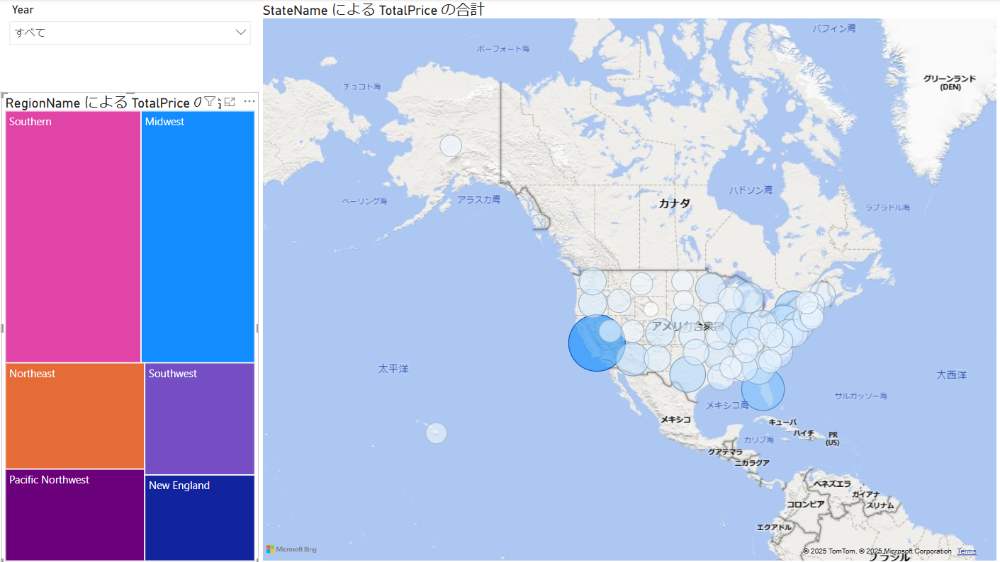
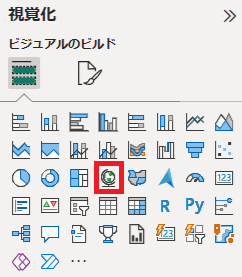

# Power BI Desktopを使用したレポートの作成

## **ラボ概要**

本ラボでは、これまでに用意したデータを使用してグラフビジュアルなどを使用したレポートを作成します。レポートにいくつかのページを作成して、データ分析を行えるよう構成します。

- レポートの作成

**このラボの実施には約45分かかります。**

**※前の演習が完了していない場合は、以下のファイルを開いてから手順を開始してください**

**C:\Users\ctct\Documents\LabSamples\Lab05.pbix**

## レポートの作成

このタスクではページ分割されたレポートを作成します。

1. 以前のタスクで使用したウィンドウが開いている場合はそのまま次の作業に進みます。

   Power BI Desktopを終了している場合は保存したpbixファイルを開いてから後続の作業を実施してください。

2. 下準備として新しいレポートページを作成し、これまで使用してきたレポートページを削除します。

> 注：これまでの作業内容を保持したい場合は、別ファイルとして保存するか、保存済みのpbixファイルをコピーしてバックアップしてください。

## レポートページ1を作成する

最初のレポートページでは、概要を確認するためのレポートページを作成します。

1. 画面下部に表示されているページ名（ページ1、ページ2など）をダブルクリックして、名称を **概要** に変更します。

   

2. ページに表示される内容をフィルタリングするための **スライサー** を配置します。スライサーはビジュアルの一種であり、レポートページに配置して簡単にフィルタリング項目を切り替えることができます。

   

3. 配置された **スライサー** ビジュアルに **Date** テーブルの **Year** 列を追加します。

   > 注：Fiscal階層内のYearではなく、単純な列項目としてのYearを追加します。

4. **スライサー** ビジュアルが選択された状態で、 **視覚化ペイン** の **ビジュアルの書式設定** を選択します。

5. **スライサーの設定** を展開し、 **スタイル** のドロップダウンリストから **ドロップダウン** に変更します。同じく **選択項目** を展開し、 **[すべて選択]オプションを表示する** をオンにします。

6. もうひとつ **スライサー** ビジュアルを追加します。今回は **State** テーブルの **RegionName** を追加します。

   > 注：前回同様に階層内ではなく単純な列項目を追加します。
   >
   > 新しくビジュアルを配置する場合は、一度レポートの空白部分（ビジュアルの外）をクリックして選択を解除します。配置済みビジュアルが選択された状態で視覚化ペインのビジュアルを選択すると、配置済みのビジュアル種別が変更されます。

7. 一度レポートの空白部分をクリックし、前回と同様に **視覚化ペイン** の **ビジュアルの書式設定** を選択して、 **スタイル** はそのままに、 **選択項目** を展開して **[すべて選択]オプションを表示する** をオンにします。

   > 注：ビジュアルが選択された状態で視覚化ペインのビジュアルを選択しても新規配置はできません。視覚化ペインがビジュアルの編集用に切り替わるため、書式設定や既存のビジュアルの種別変更が行われます。

   

8. これで簡単に年度単位、地域単位、もしくは両方のフィルターを適用してレポートページ内の表示内容を変更することが可能になりました。

9. 続けてグラフビジュアルを追加します。 **折れ線グラフおよび積み上げ棒グラフ** を配置します。

   

10. 配置したグラフビジュアルに以下の列項目を追加します。ビジュアルを選択した状態で **データペイン** の列項目や階層を **視覚化ペイン** の各軸項目にドラッグアンドドロップすることで追加できます。

   - X軸：Dateテーブル | Month列
   - 列のY軸：Salesテーブル | TotalPrice列
   - 線のY軸：Salesテーブル | Quantity列

11. これにより、月単位での売り上げ額と販売個数の推移がグラフで確認できるようになりました。

    

12. グラフビジュアルのタイトルを変更します。視覚化ペインのビジュアルの書式設定から **全般** タブを選択します。 **タイトル** を展開し、 **テキスト** に **「月別売り上げ額と販売個数の推移」** と入力します。

13. 各軸のタイトルを変更する場合は、 **ビジュアル** タブのそれぞれの軸項目にある **タイトルテキスト** を編集します。

14. 続けて地域ごとの売り上げ比較を行うグラフを作成します。視覚化ペインにて、 **積み上げ縦棒グラフ** を選択して配置します。

    

15. 配置したグラフビジュアルに以下の列項目を追加します。

    - X軸：Stateテーブル | RegionName列
    - Y軸：Salesテーブル | TotalPrice列
    - 凡例：Productテーブル | ProductCategory列

16. これにより、地域におけるカテゴリ単位での売り上げがグラフで確認できるようになりました。

    

17. 最後にカテゴリーごとの売り上げ比較を行うグラフを作成します。視覚化ペインにて、 **集合横棒グラフ** を選択して配置します。

18. 配置したグラフビジュアルに以下の列項目を追加します。

    - Y軸：Productテーブル | ProductCategory列
    - X軸：Salesテーブル | Quantity列

19. これにより、カテゴリー単位での売り上げ比較をグラフで確認できるようになりました。

    

20. ページ内のビジュアル位置・サイズを調整します。ビジュアルは選択してドラッグすることで位置移動、ビジュアル端をドラッグすることでサイズを調整できます。

21. ビジュアル間での連携動作を制御します。各グラフで特定のデータポイントを選択すると、他のビジュアルを強調表示したり、フィルターを適用することが可能です。

22. 動作の制御は **相互作用を編集** することで設定可能です。上部に配置した **月別売り上げと販売個数の推移** ビジュアルを選択した状態で **書式** リボンメニューから **相互作用を編集** をクリックします。

    

23. **相互作用の編集** を開始すると、各ビジュアルの端に設定用のアイコンが表示されます。それぞれ左から以下のように動作します。

    - フィルター：選択されたデータポイントでフィルターされたグラフサイズに先行されます
    - 強調表示：グラフサイズを変更せずにフィルターされた範囲を強調表示します
    - なし：選択されたビジュアルでデータポイントが選択されても連携しません

24. 今回のラボでは左下に配置した **RegionName および ProductCategory による TotalPrice の合計** で **フィルター** を選択します。

25. 相互作用の編集を完了します。書式リボンメニューにて再度 **相互作用の編集** をクリックします。

26. 相互作用をテストします。 **月別売り上げと販売個数の推移** でグラフ項目をクリックします。

27. 下部に表示されている2つのグラフビジュアルが別々の動きをするはずです。それぞれフィルターと強調表示が相互作用として行われています。

    

28. 1ページ目の配置は以上となります。

## レポートページ2の作成

2つめのレポートページでは、マップビジュアルを使用した確認が行えるようにします。

1. 新しいレポートページを作成し、名称を **マッピング** に変更します。

1. **概要** のレポートページ同様に、まずは **スライサー** ビジュアルを配置します。配置された **スライサー** ビジュアルに **Date** テーブルの **Year** 列を追加します。

1. 続けて、視覚化ペインから **ツリーマップ** のビジュアルを選択して配置します。

      

1. 配置したグラフビジュアルに以下の列項目を追加します。

      - 詳細：Stateテーブル | RegionName列
      - 値：Salesテーブル | TotalPrice列

1. ツリーマップでは色分けされたタイルのサイズで視覚的に比較を行えるビジュアルです。今回は地域ごとの売り上げ額の比率を見ることができています。

      

1. 続けて、視覚化ペインから **マップ** のビジュアルを選択して配置します。

      

1. 配置したグラフビジュアルに以下の列項目を追加します。

      - 場所：Stateテーブル | StateName列
      - バブルサイズ：Salesテーブル | TotalPrice列

1. デフォルトの設定ではバブルのサイズが小さいため、サイズを調整します。ビジュアルが選択されている状態で、 **視覚化ペイン** の **ビジュアルの書式設定** から **バブル** を展開し、 **サイズ** を **0** に変更します。

1. 同じく書式設定のバブルにて **色** を展開し、 **fx** のボタンをクリックします。

      

1. **既定色 - バブル - 色** のウィンドウで以下の項目を設定します。設定が完了したら **OK** をクリックして適用します。

      - スタイルの書式設定：グラデーション
      - 基準にするフィールド：TotalPriceの合計
      - 最小値：白（色リストを展開して左上）

      

1. これにより、地図上にバブルを配置して州ごとの売り上げ比較を行えるようになりました。

      

## レポートページ3の作成

最後のレポートページはドリルスルーを行うページとして設定します。ドリルスルーでは、特定の項目を選択して掘り下げを行うことができる機能です。

1. 新しいレポートページを作成し、名称を **プロダクト詳細** に変更します。

2. シート名称を右クリックして、 **非表示** とします。

   > 注：非表示にすることで、Power BI Serviceで教育した際に直接ページを選択することができなくなります。ドリルスルーは他のビジュアルで特定の項目を選択して行うため、直接選択できないように非表示としています。

3. 視覚化ペインにある **ドリルスルー** セクションにて、 **Product** 列の **ProductCategory** 列を **ドリルスルー フィールドをここに追加します** のボックスに追加します。

   

4. レポート ページの左上に矢印ボタンが出現します。ドリルスルーページは他のビジュアルから移動する形で表示されるため、元のページへ戻るボタンが自動で用意されます。

5. 視覚化ペインから **カード** ビジュアルを配置します。ビジュアルには **Product** テーブルの **ProductCategory** 列を追加します。

   

   

6. **カード** ビジュアルの **カテゴリラベル** は不要なため、ビジュアルの書式設定でオフにします。

   

7. 続けて **テーブル** ビジュアルを配置して製品ごとの売り上げを確認できるようにします。視覚化ペインから **テーブル** ビジュアルを選択します。

   

8. 配置したテーブルビジュアルに以下の列項目を追加します。

   - Productテーブル | image列
   - Productテーブル | ItemGroup列
   - Productテーブル | ProductName列
   - Productテーブル | Demographic列
   - Salesテーブル | Quantity列
   - Salesテーブル | TotalPrice列

9. 商品情報と売り上げ個数・額が表として表示されます。

   

10. 視覚化ペインから **ドーナツグラフ** を追加して購買層が確認できるようにします。

    

11. 配置したテーブルビジュアルに以下の列項目を追加します。

    - 凡例：Productテーブル | Demographic列
    - 値：Salesテーブル | TotalPrice列

12. これにより、購買層ごとの売り上げ割合が確認できるようになりました。

    

13. これでレポートページ3は作成が完了しました。

    

14. ドリルスルーが正しく動作するかテストします。 **概要** ページへ移動して、右下に配置されている **ProductCategoryによるQuantityの合計** を確認します。いずれかのカテゴリのグラフ項目を右クリックして、 **ドリルスルー** → **プロダクト詳細** をクリックします。

    

15. 右クリックしたグラフ項目に合わせたフィルタリングが行われる形で **プロダクト詳細** のレポートページが表示されるはずです。

    

16. 左上の矢印ボタンをCtrlキーを押しながらクリックすると **概要** ページに戻ることが可能です。

## レポートページをまたいだ設定

レポートページをまたいでスライサーが同期されるように設定を追加します。現状では **概要** ページと **マップ** ページのスライサーは同期していないため、それぞれで年度を選択する必要があります。

1. **スライサーの同期** を設定するには、 **表示** メニューから **スライサーの同期** をクリックします。

   

2. **スライサーの同期ペイン** が表示されます。スライサーを選択することで、当該のスライサーに対する同期および可視/不可視の設定を行うことが可能です。

   

3. 矢印が輪になっているアイコン列のチェックボックスとオンにすると同期が有効になり、目のアイコン列のチェックボックスをオンにすると当該ページでスライサーが表示されます。

4. 今回は **概要** と **マップ** のページで同期を有効化します。これにより、選択された年度の状態がページ間で共有されます。

## ラボの完了

このタスクでは、次のラボに向けて一度ラボを保存して本ラボを完了します。

作業状況をPower BI Desktopファイルとして保存します。 **Ctrl+S** 、もしくは **ファイル** をクリックして **保存** 、左上の **フロッピーアイコン** をクリックして上書き保存します。
保留中の変更の適用を求めるダイアログが表示されたら、 **[後で適用]** を選択します。

※演習が最後まで完了しなかった場合は、以下のファイルを開くことで手順を最後まで実施した状態になります。
C:\Users\ctct\Documents\LabSamples\Lab06.pbix
