# Power BI Serviceを使用した共有

## **ラボ概要**

本ラボでは、Power BI Desktopで作成したレポートとデータセットをPower BI Serviceに発行（アップロード）します。Power BI Desktop単体では直接的な共有機能を持たないため、Power BI Serviceで共有空間を用意する必要があります。

- レポートの発行
- ダッシュボードの作成

**このラボの実施には約15分かかります。**

**※前の演習が完了していない場合は、以下のファイルを開いてから手順を開始してください**

> 注：「適用されていない保留中の変更がクエリにあります」のメッセージが表示された場合は、「変更を破棄する」のボタンをクリックして先に進めます。
>
> データの読み込みは完了しているため、再度クエリを適用する必要はありません。

**C:\Users\ctct\Documents\LabSamples\Lab06.pbix**

## レポートの発行

このタスクでは、これまでに作成したレポートを発行します。

1. 以前のタスクで使用したウィンドウが開いている場合はそのまま次の作業に進みます。
   Power BI Desktopを終了している場合は保存したpbixファイルを開いてから後続の作業を実施してください。

2. Power BI Desktopの **レポートビュー** で **ホーム** リボンメニューから **発行** をクリックします。

   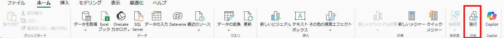

3. **Power BIへ発行** のウィンドウでは、発行先となる **ワークスペース** を選択します。アクセス権を持つワークスペースが表示されますが、現状は **マイワークスペース** のみが表示されるはずです。**マイワークスペース** を選択して **選択** のボタンをクリックします。

   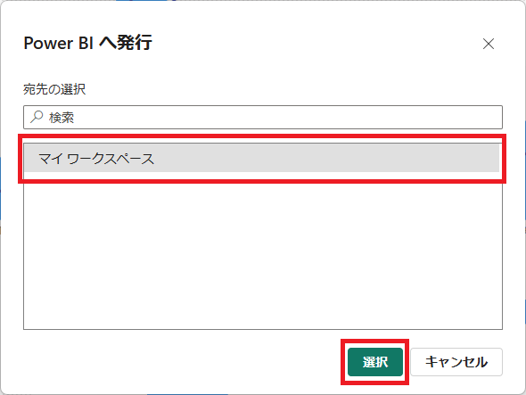

4. 発行が完了すると以下のウィンドウが表示されます。 **Power BI で [レポート名].pbix を開く** をクリックすると、ブラウザが起動して発行したレポートを確認することができます。サインインが求められた場合は、演習用アカウントを使用してサインインします。

   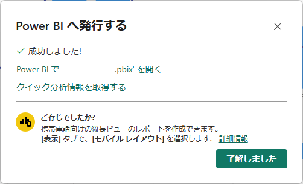

   | 項目       | 値                                                           |
   | ---------- | ------------------------------------------------------------ |
   | メール     | **PBIUser##@ctctedu.onmicrosoft.com**<br />※##の部分には01～99の数字になります。<br/>　演習用仮想マシンと同一の番号に置き換え、入力してください |
   | パスワード | **講師より配布された演習用仮想マシンのパスワードと同一**     |

5. ブラウザでレポートが確認できるはずです。レポートの状態は発行した際のフィルター条件などを引き継ぎます。特定のスライサー項目やフィルター条件を指定したい、もしくは指定したくない場合はPower BI Desktop上で設定をしておく必要があります。

   変更後に同名のレポートを再発行することで上書きすることが可能です。

   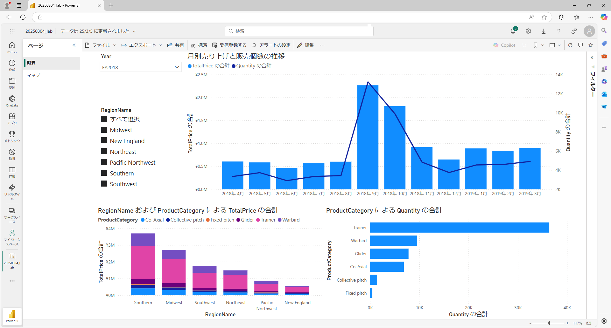

6. レポートが発行された **マイワークスペース** を確認します。ワークスペースへ移動するには画面左側のメニューより **ワークスペース** アイコンをクリックして移動したワークスペースを選択します。今回は **マイワークスペース** をクリックします。

   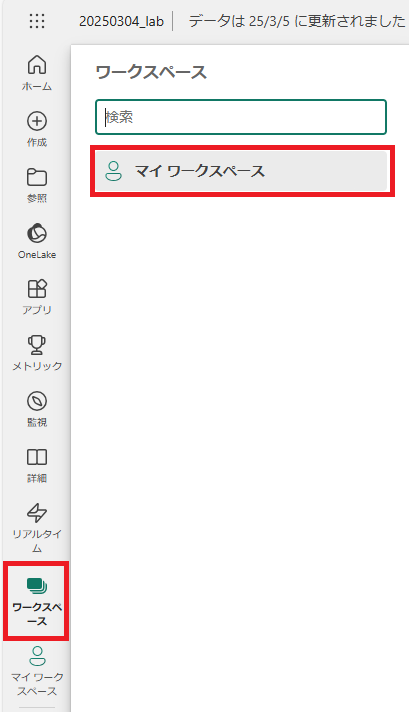

7. ワークスペースが表示されます。内容物として、 **レポート** と **セマンティックモデル** が確認できます。 **セマンティックモデル** はデータセット（データとモデル）を示しています。

   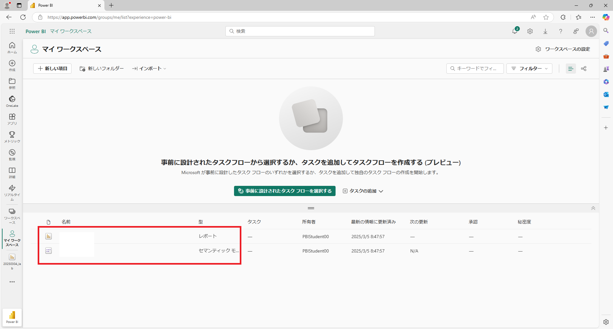

8. レポートとデータセットが発行（アップロード）されたことが確認できました。ただし、今回のタスクで発行先として指定した **マイワークスペース** は個人用の作業空間となります。

   他ユーザーと共有を行うためには、 **ワークスペース** を作成して設定するか、既存の **マイワークスペース** 以外のワークスペースを指定します。

   > 注：単純なレポートの共有については組織（テナント）内であれはリンクでの共有、組織外であればレポートの埋め込みで実行可能です。
   >
   > ただし、リンクや埋め込みでの共有は読み取り専用（閲覧のみ、編集不可）となります。また、レポートの埋め込みでWeb公開した場合は認証等がなくパブリックに公開されるため注意が必要です。

   

## ダッシュボードの作成

このタスクではPower BI Serviceを使用してダッシュボードを作成します。ダッシュボードは1つの画面で構成され、既存のビジュアルなどからタイル（ビジュアル）をピン留めして作成します。

1. 以前のタスクで発行したを開きます。

2. 開いたレポートを確認し、年度を示すスライサーを **FY2018** に設定してから **月別売り上げと販売個数の推移** を選択します。

3. ビジュアルの端に表示される **押しピンのアイコン** をクリックします。

   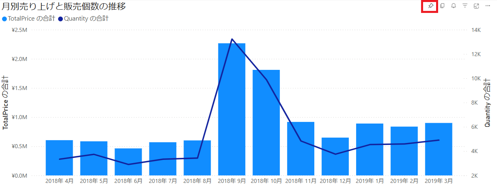

4. **ダッシュボードにピン留めする** の画面では、 **既存のダッシュボード** もしくは **新しいダッシュボード** からピン留め先を選択できます。今回は既存のダッシュボードがないため、 **新しいダッシュボード** にピン留めします。 **ダッシュボード名** を決定する必要があるため、 **NewDashboard** と入力します。

5. ダッシュボードが作成されると、画面上に通知が表示されます。 **ダッシュボードへ移動** のボタンをクリックすることで移動します。

   > 注：通知は短時間で消えます。確認できなかった場合は、ワークスペースに移動して、作成されたダッシュボードに移動します。

   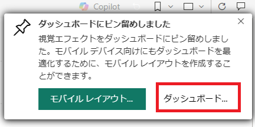

6. ダッシュボードに移動すると、先ほどピン留めしたタイル（ビジュアル）が確認できるはずです。

   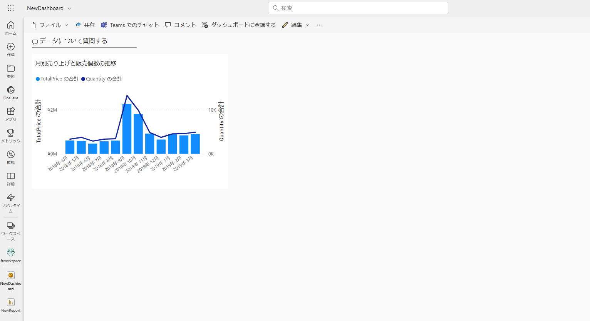

7. ダッシュボードにロゴを追加します。ダッシュボードの上部にある **編集** のドロップダウンリストから **タイルの追加** をクリックします。

   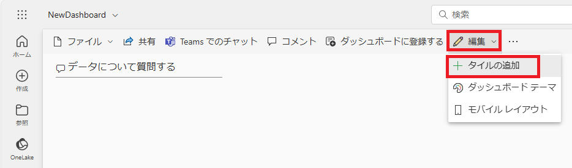

8. **タイルの追加** 画面では **イメージ** をクリックして **次へ** のボタンをクリックします。

   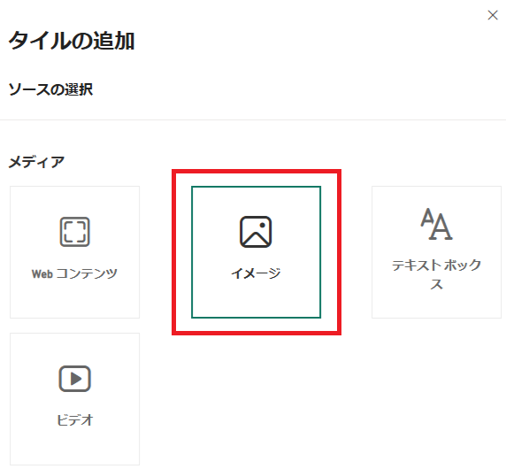

9. **画像タイルの追加** 画面では、 **URL** の欄に以下のURLを入力します。入力後は **適用** ボタンをクリックします。

   ```
   https://pbifb.blob.core.windows.net/tailspintoys/tailspintoys_logo.png
   ```

   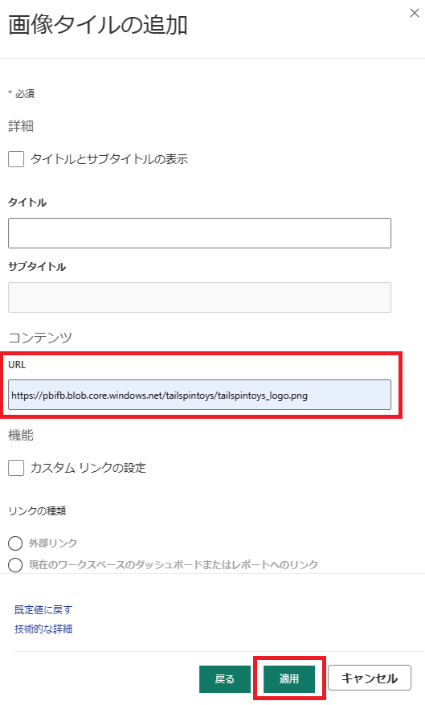

10. ダッシュボードに画像のタイルが追加されました。

    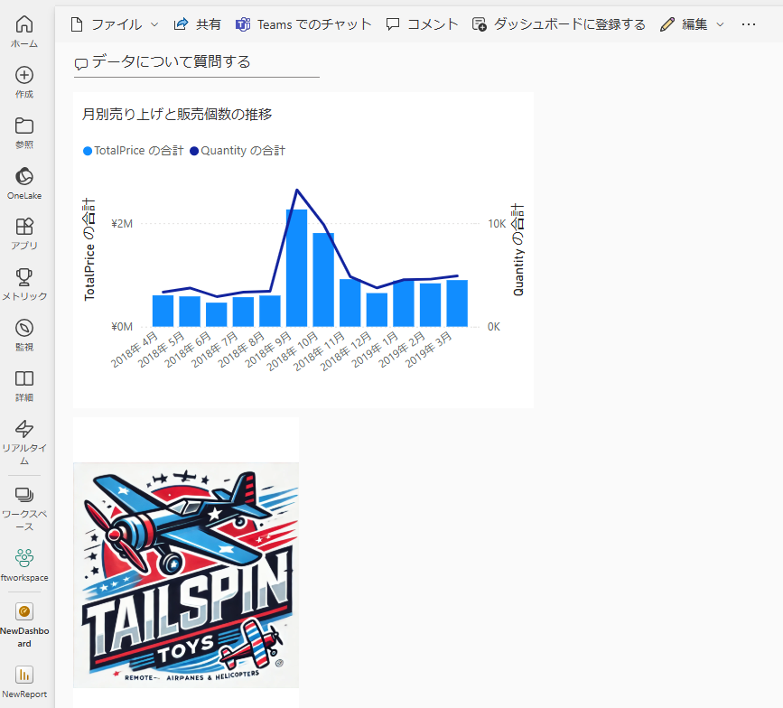

11. 続けてQA機能を使用したタイルを追加します。ダッシュボード上部にデフォルトで表示されている **データについて質問する** の項目をクリックします。

    > 注：この手順で使用するQA機能は非常に便利な機能ですが、日本語に対応していません。簡単な英語と数字で操作することができます。

    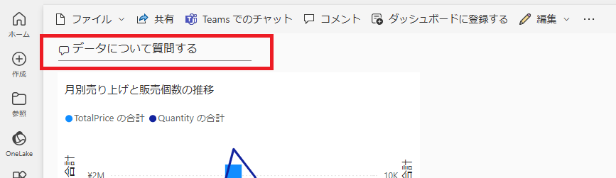

12. **データについて質問する** のテキストボックスに **Sales YTD in FY2018** と入力します。

    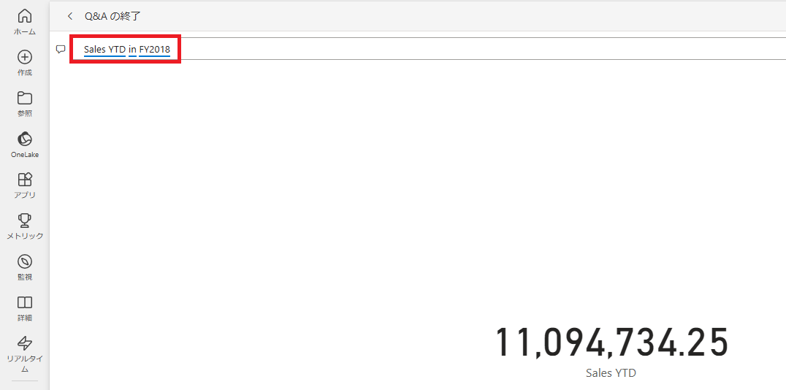

13. 2018年度における売り上げ累積値が表示されます。これをダッシュボードにピン留めします。QA機能の右上に表示されている **ビジュアルにピン留めする** をクリックします。今回は **既存のダッシュボード** として作成した **NewDashboard** を選択してピン留めします。

    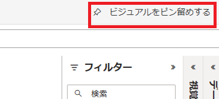

14. ダッシュボードへ移動すると、 **Sales YTD** のタイルが追加されているはずです。タイルにはどの年度かを示す情報がないため、タイルを編集してサブタイトルを追加します。

15. タイルにマウスオーバーすると、三点リーダのボタンが表示されます。ボタンをクリックして **詳細の編集** を選択します。

    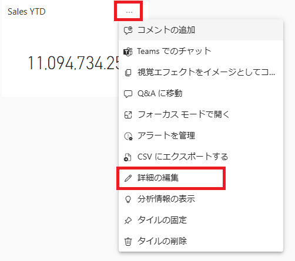

16. **タイルの詳細** 画面では、 **サブタイトル** として **FY2018** と入力して **適用** します。

    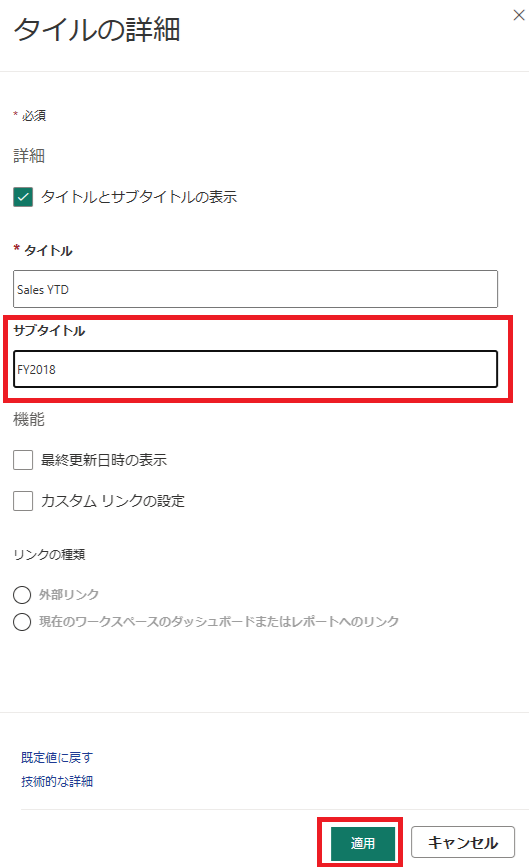

17. タイルにサブタイトルが追加されました。

    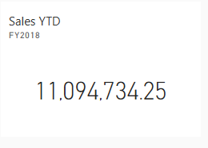

18. ダッシュボートもレポートページと同様にタイルを動かして配置やサイズを変更できます。

    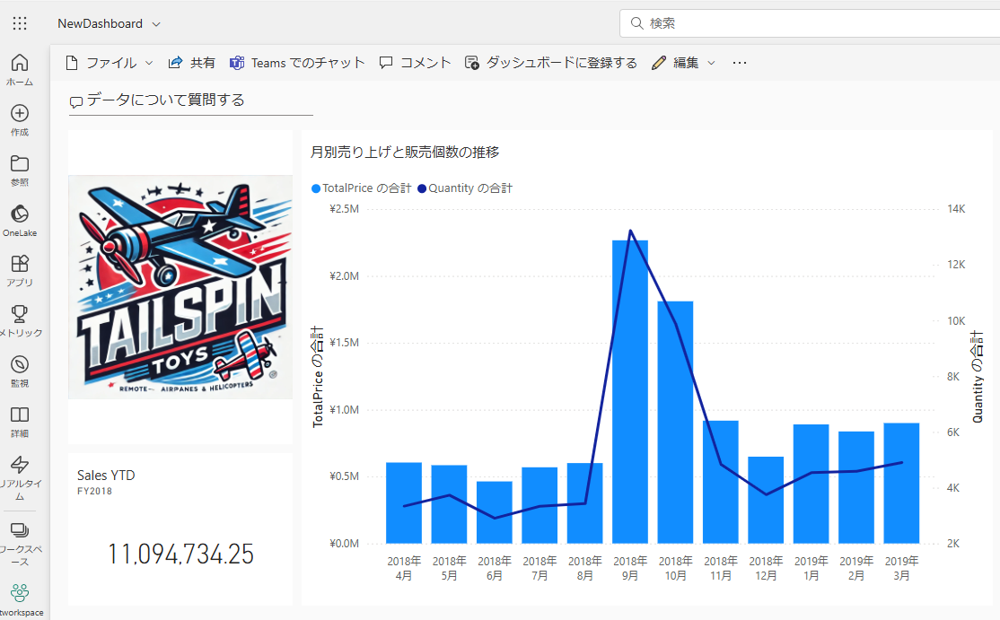

19. 以上でラボは終了です。お疲れさまでした。

