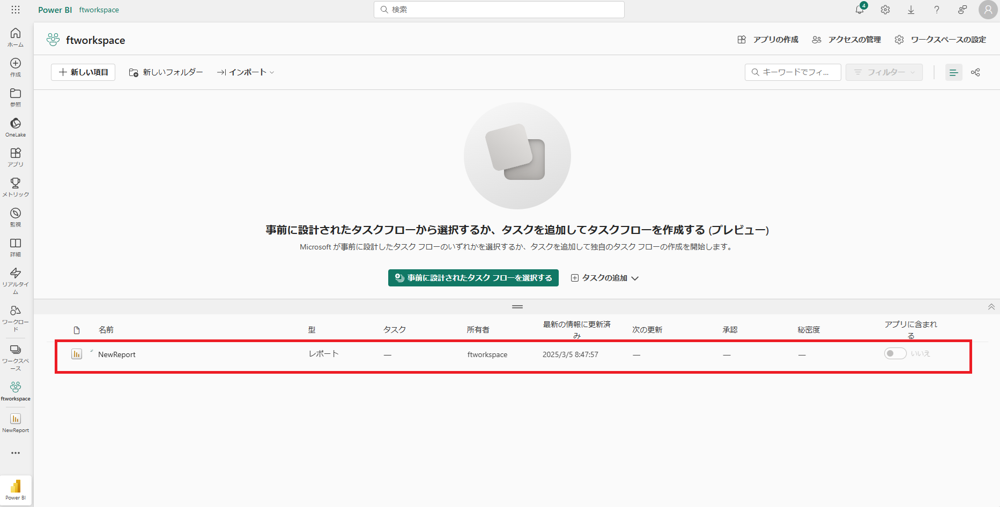

# Power BI Serviceを使用した共有

## **ラボ概要**

本ラボでは、Power BI Desktopで作成したレポートとデータセットをPower BI Serviceに発行（アップロード）します。Power BI Desktop単体では直接的な共有機能を持たないため、Power BI Serviceで共有空間を用意する必要があります。

- レポートの発行
- ワークスペースの作成
- ワークスペースの設定
- ダッシュボードの作成

**このラボの実施には約35分かかります。**

**※前の演習が完了していない場合は、以下のファイルを開いてから手順を開始してください**

**C:\Users\ctct\Documents\LabSamples\Lab06.pbix**

## レポートの発行

このタスクでは、これまでに作成したレポートを発行します。

1. 以前のタスクで使用したウィンドウが開いている場合はそのまま次の作業に進みます。
   Power BI Desktopを終了している場合は保存したpbixファイルを開いてから後続の作業を実施してください。

2. Power BI Desktopの **レポートビュー** で **ホーム** リボンメニューから **発行** をクリックします。

   

3. **Power BIへ発行** のウィンドウでは、発行先となる **ワークスペース** を選択します。アクセス権を持つワークスペースが表示されますが、現状は **マイワークスペース** のみが表示されるはずです。**マイワークスペース** を選択して **選択** のボタンをクリックします。

   

4. 発行が完了すると以下のウィンドウが表示されます。 **Power BI で [レポート名].pbix を開く** をクリックすると、ブラウザが起動して発行したレポートを確認することができます。サインインが求められた場合は、演習用アカウントをを使用してサインインします。

   

   | 項目       | 値                                                           |
   | ---------- | ------------------------------------------------------------ |
   | メール     | **PBIStudent##@ctctedu.onmicrosoft.com**<br />※##の部分には01～99の数字になります。<br/>　講師から提示された番号に置き換え、入力してください |
   | パスワード | **Pa55w.rdabc123**                                           |

5. ブラウザでレポートが確認できるはずです。レポートの状態は発行した際のフィルター条件などを引き継ぎます。特定のスライサー項目やフィルター条件を指定したい、もしくは指定したくない場合はPower BI Desktop上で設定をしておく必要があります。

   変更後に同名のレポートを再発行することで上書きすることが可能です。

   

6. レポートが発行された **マイワークスペース** を確認します。ワークスペースへ移動するには画面左側のメニューより **ワークスペース** アイコンをクリックして移動したワークスペースを選択します。今回は **マイワークスペース** をクリックします。

   

7. ワークスペースが表示されます。内容物として、 **レポート** と **セマンティックモデル** が確認できます。 **セマンティックモデル** はデータセット（データとモデル）を示しています。

   

8. レポートとデータセットが発行（アップロード）されたことが確認できました。ただし、今回のタスクで発行先として指定した **マイワークスペース** は個人用の作業空間となります。

   他ユーザーと共有を行うためには、 **ワークスペース** を作成して設定するか、既存の **マイワークスペース** 以外のワークスペースを指定します。

   > 注：単純なレポートの共有については組織（テナント）内であれはリンクでの共有、組織外であればレポートの埋め込みで実行可能です。
   >
   > ただし、リンクや埋め込みでの共有は読み取り専用（閲覧のみ、編集不可）となります。また、レポートの埋め込みでWeb公開した場合は認証等がなくパブリックに公開されるため注意が必要です。

9. 次のタスクではワークスペースの作成と設定を行います。

## ワークスペースの作成

このタスクでは、共有空間としてワークスペースの作成を行います。

1. 先ほどのタスクでワークスペースへの移動を実行した画面を使用して、 ワークスペースを新規に作成します。 **+新しいワークスペース** をクリックします。

   

2. **ワークスペースの作成** 画面では以下の項目を設定します。設定が完了したら **適用** のボタンをクリックします。

   - 名前：任意の名称を設定（テナントで一意な名称）
     例：頭文字+"workspace" (ftworkspace)
   - ライセンスモード（詳細を展開して設定）：Pro

   

3. 新しく作成されたワークスペースへ自動的に移動します。新規のワークスペースにはまだ何も発行されていないため、コンテンツを追加します。
   

4. 画面左側の **ワークスペース** アイコンをクリックして、再度 **マイワークスペース**へ移動します。 **マイワークスペース** には発行済みの **レポート** が存在しているはずです。

5. 発行済みの **レポート** 項目にマウスオーバーすると三点リーダ（・・・）のボタンが表示されます。ボタンをクリック後に表示されたメニューで **コピーの保存** をクリックします。

   

6. **このレポートのコピーを保存します** の画面では、 **先ほどの作業で作成したワークスペース** を選択します。また、 **レポートの名前を入力...** の欄に **NewReport** と入力します。選択と名称設定が完了したら **保存** をクリックします。

   

7. これで作成したワークスペースに対してレポートが配置されました。

   

8. コピーされたレポートは単純な複製として作成されるため、コピー元のレポートが変更、削除されても影響を受けません。

9. ワークスペースにコンテンツは追加されましたが、現状では他のユーザーがこのワークスペースにアクセスすることができません。次のタスクでは他のユーザーを共有できるように設定を行います。

## ワークスペースの設定

このタスクでは、新しく作成したワークスペースにアクセス権などの設定を行います。

1. 先ほどのタスクで作成したワークスペースに移動し、右上に表示されている **ワークスペースの設定** を確認します。

   

2. **ワークスペースの設定** では、作成時に設定したワークスペース名や説明、ライセンス割当などの設定変更を行うことができます。追加の設定として、他サービスとの接続についても設定が可能です。

   > 注：ワークスペースそのものの削除についても全般から行うことができます

   

3. 設定可能な項目を確認し、このラボでは設定を変更せずに **ワークスペースの設定** 画面を閉じます（右上の×ボタン）。

4. 続けて、ワークスペースの画面から **アクセス権の管理** をクリックします。

   > 注：マイワークスペースにいる場合はこのボタンが表示されません。マイワークスペースは個人用の作業スペースとなるため、他ユーザーへのアクセス権の付与することができません。

   

5. **アクセスの管理** 画面では、現状割り当てられているアクセス権を確認することができます。現状では、自分自身に対しての **管理者** ロールのみが割り当てられているはずです。

6. 他ユーザーへアクセス権を付与するため、 **ユーザーまたはグループの追加** ボタンをクリックします。

   

7. **ユーザーの追加** 画面では、ユーザーやグループを追加してアクセス権を付与します。

   **名前またはメールアドレスを入力してください** のボックスに **PBI** と入力すると、本研修で使用している他ユーザーの情報が表示されます。

   

8. 表示されたユーザー情報の内、 **PBIStudent00** （講師使用アカウント）を選択します。ユーザーが表示されているボックス下側にあるドロップダウンリストを展開して、割り当てるロールを選択します。今回は **ビューアー** のロールを割り当てます。

   **メンバー** のロールを選択後、 **追加** ボタンをクリックして割り当てを追加します。

   

9. 追加が完了すると、緑色のチェックマークのアイコンが一時的に表示されます。割り当てが完了しているかは、 **ユーザーの追加** のタイトル左側に表示される矢印ボタンで前画面に戻ることで確認できます。

10. **アクセスの管理** 画面でアクセス権を確認すると、先ほどとは異なり自分自身に加えて選択したユーザーが表示されているはずです。これで他ユーザーもこのワークスペース内のコンテンツにアクセスすることが可能になりました。

    > 注：割り当てられたロールの種類によって実行できる内容は異なります。今回割り当てたビューアーは閲覧権のみを持つため、コンテンツ作成や編集はできません。

## ダッシュボードの作成

このタスクではPower BI Serviceを使用してダッシュボードを作成します。ダッシュボードは1つの画面で構成され、既存のビジュアルなどからタイル（ビジュアル）をピン留めして作成します。

1. 先ほどコピーしたレポート **(NewReport)** を開きます。

2. 開いたレポートを確認し、年度を示すスライサーを **FY2018** に設定してから **月別売り上げと販売個数の推移** を選択します。

3. ビジュアルの端に表示される **押しピンのアイコン** をクリックします。

   

4. **ダッシュボードにピン留めする** の画面では、 **既存のダッシュボード** もしくは **新しいダッシュボード** からピン留め先を選択できます。今回は既存のダッシュボードがないため、 **新しいダッシュボード** にピン留めします。 **ダッシュボード名** を決定する必要があるため、 **NewDashboard** と入力します。

5. ダッシュボードが作成されると、画面上に通知が表示されます。 **ダッシュボードへ移動** のボタンをクリックすることで移動します。

   > 注：通知は短時間で消えます。確認できなかった場合は、ワークスペースに移動して、作成されたダッシュボードに移動します。

   

6. ダッシュボードに移動すると、先ほどピン留めしたタイル（ビジュアル）が確認できるはずです。

   

7. ダッシュボードにロゴを追加します。ダッシュボードの上部にある **編集** のドロップダウンリストから **タイルの追加** をクリックします。

   

8. **タイルの追加** 画面では **イメージ** をクリックして **次へ** のボタンをクリックします。

   

9. **画像タイルの追加** 画面では、 **URL** の欄に以下のURLを入力します。入力後は **適用** ボタンをクリックします。

   ```
   https://pbifb.blob.core.windows.net/tailspintoys/tailspintoys_logo.png
   ```

   

10. ダッシュボードに画像のタイルが追加されました。

    

11. 続けてQA機能を使用したタイルを追加します。ダッシュボード上部にデフォルトで表示されている **データについて質問する** の項目をクリックします。

    > 注：この手順で使用するQA機能は非常に便利な機能ですが、日本語に対応していません。簡単な英語と数字で操作することができます。

    

12. **データについて質問する** のテキストボックスに **Sales YTD in FY2018** と入力します。

    

13. 2018年度における売り上げ累積値が表示されます。これをダッシュボードにピン留めします。QA機能の右上に表示されている **ビジュアルにピン留めする** をクリックします。今回は **既存のダッシュボード** として作成した **NewDashboard** を選択してピン留めします。

    

14. ダッシュボードへ移動すると、 **Sales YTD** のタイルが追加されているはずです。タイルにはどの年度かを示す情報がないため、タイルを編集してサブタイトルを追加します。

15. タイルにマウスオーバーすると、三点リーダのボタンが表示されます。ボタンをクリックして **詳細の編集** を選択します。

    

16. **タイルの詳細** 画面では、 **サブタイトル** として **FY2018** と入力して **適用** します。

    

17. タイルにサブタイトルが追加されました。

    

18. ダッシュボートもレポートページと同様にタイルを動かして配置やサイズを変更できます。

    

19. 以上でラボは終了です。お疲れさまでした。

